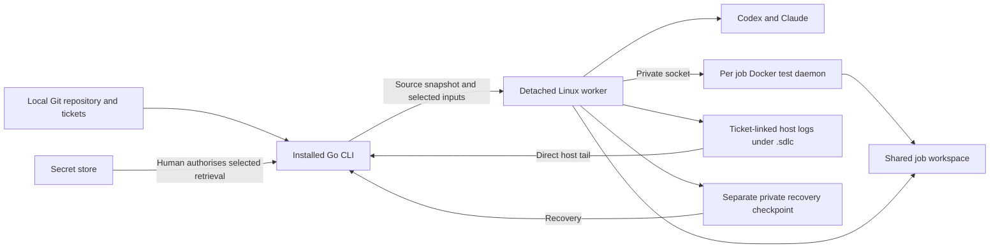

# CLI language and container workflow

Research date: 3 October 2026. This is a proposed design, not an implemented
command reference.

Use **Go for the installed host CLI** and build **one shared SDLC image per
installation on the selected Docker engine**. Every repository uses that image.
Each job creates a disposable worker container from it, with its own checkout
and Docker test daemon. The host command should set up and authenticate the
shared runtime, capture work from the current repository, obtain selected
secrets, start a detached job, show progress, and continue a stopped job.
Retain job logs in a ticket-linked host directory under the initiating
repository's `.sdlc` folder. Nested Docker containers and test storage remain
disposable.

## One shared SDLC image

The CLI owns one installation-wide image tag and runtime lock. Repository names,
paths, accounts and jobs never select a different SDLC image or become its build
inputs. Build once during setup; rebuild that shared image only for an accepted
global runtime update. `init`, `work` and `resume` use the existing image and
report a missing runtime with instructions to run setup.

Build and verify Docker images locally. CI may validate source, run offline
checks and build the host CLI, but it must not build, run or publish the Docker
runtime. Docker-dependent smoke checks remain local commands.

Repository source, tickets, profiles, secrets and test inputs are supplied at
launch. They stay outside the SDLC build context. The image contains the common
runner tools, provider CLIs, skills and agents. Additional project dependencies
are restored into disposable job storage, or run in SDK/test containers under
the job's Docker daemon. Project application/test image builds are part of that
job; they do not create a repository-specific SDLC image.

Use an installation-wide lock for setup and updates, so commands from two
repositories cannot build or replace the image concurrently. Keep per-job
workspace and lifecycle locks separate from that build lock.

Disposable containers and resumable work can coexist if job state survives
outside the container's writable layer. A new job starts without another job's
checkout or conversation. Continuing a job deliberately restores that job's
checkpoint. Deleting every copy of its work and session data prevents recovery.



## Language and installation

This is a process coordinator: Docker and Git operations, JSON streams, local
configuration, secrets retrieval, and lifecycle management. My recommendation
is based on those requirements, not a performance benchmark.

| Language | Fit | Distribution cost |
| --- | --- | --- |
| **Go** | Standard process, JSON, filesystem and concurrency APIs cover most host work. | Native executables for macOS, Linux and Windows; avoid C dependencies in the host core where practical. |
| Rust | Equally credible for a native CLI, particularly with existing Rust expertise. | Cross compilation needs target libraries and suitable linkers/toolchains. More build setup offers little benefit for this coordinator. |
| TypeScript with Node | Good stream handling; useful if sharing code with a future UI becomes a requirement. | npm installation normally needs Node. Node's single executable packaging adds constraints and is documented as active development. |
| Python | Best way to keep extending the current prototype quickly. | Requires an interpreter or bundled platform builds. PyInstaller does not cross compile. |

Primary documentation: [Go builds](https://pkg.go.dev/cmd/go#hdr-Compile_packages_and_dependencies),
[Go targets](https://go.dev/doc/install/source#environment),
[Go processes](https://pkg.go.dev/os/exec),
[Rust cross compilation](https://rust-lang.github.io/rustup/cross-compilation.html),
[Node single executable applications](https://nodejs.org/api/single-executable-applications.html),
[PyInstaller platforms](https://pyinstaller.org/en/stable/).

Target macOS and Linux on ARM64 and x86-64 first. Build Windows ARM64 and x86-64
executables from the start, but call Windows supported only after native tests
pass. All platforms use a Linux Docker engine; Windows containers are outside
this design. Support ARM64 and x86-64 variants of the same SDLC image, loading
only the variant needed by the installation's Linux engine. Architecture support
does not introduce different images per repository.
[Docker multi-platform builds](https://docs.docker.com/build/building/multi-platform/).

Publish versioned archives and checksums through GitHub Releases. Provide a
Homebrew tap for macOS/Linux and a Scoop manifest for Windows, with winget as a
later distribution channel. These packages put `sdlc` on PATH. Manual archive
installation into a user-selected PATH directory remains available.
[GitHub Releases](https://docs.github.com/en/repositories/releasing-projects-on-github/about-releases),
[Homebrew taps](https://docs.brew.sh/Taps),
[Scoop manifests](https://github.com/ScoopInstaller/Scoop/wiki/App-Manifests),
[winget manifests](https://learn.microsoft.com/en-us/windows/package-manager/package/manifest).

For source development, provide a documented `go build` and install target.
End users of release binaries need no Go installation. The binary must carry
its protocol version and find runtime assets through the configured SDLC clone,
independently of the directory where it is invoked. Installing the command and
building the worker image are separate operations.

Keep the host core compatible with `CGO_ENABLED=0` if its dependencies permit
it. This does not promise static linking on every OS. Use argument arrays for
Git, Docker and secret-store commands; keep host paths, locking, terminal
interaction and process cancellation behind OS adapters. Ordinary pipes suffice
for JSON progress. Authentication may need an interactive terminal adapter.
[Cgo](https://pkg.go.dev/cmd/cgo), [Go executable lookup](https://pkg.go.dev/os/exec#LookPath),
[Windows pseudoconsole](https://learn.microsoft.com/en-us/windows/console/creating-a-pseudoconsole-session).

Go's default context cancellation kills the immediate child, not its whole
process tree. Windows also cannot forward `os.Interrupt` through
`Process.Signal`. Use explicit platform handling for host helpers and control
the actual worker through Docker. Killing a log-following client must not be
mistaken for stopping a job.
[Go process kill](https://pkg.go.dev/os#Process.Kill),
[Go process signals](https://pkg.go.dev/os#Process.Signal),
[Windows Job Objects](https://learn.microsoft.com/en-us/windows/win32/procthread/job-objects).

## Setup from the SDLC clone

The following commands describe the intended interface. They do not exist yet.

```sh
# After installing the release binary and cloning SDLC:
cd /PATH/TO/YOUR_SDLC_CLONE
sdlc setup --source . --refresh-catalogues
sdlc doctor
```

`setup` should check Docker access and Linux-container mode, record the runtime
source, build the one shared image, authenticate Codex, then authenticate Claude.
It should reuse a valid existing image, report each completed step and let a
repeated invocation finish missing steps. Building requires no target repository
or account profile; login state is selected separately at runtime.
The setup container receives no target-repository signing key or GitHub token.
`doctor` checks versions, catalogue discovery, provider login status and daemon
compatibility without starting model work.

Host prerequisites are Git, Docker with access to a compatible Linux engine,
and the chosen secret-store client. The release CLI should not need host Python,
Codex or Claude. Check rootful/privileged DinD support rather than assuming every
rootless or managed Docker engine accepts it.

Resolve the configured default branches of the public skills and agents
repositories to exact commit SHAs before building. Record the SHAs, provider
versions, runtime source revision and resulting image identity in the
installation-wide runtime lock. Use those SHAs as build inputs, so Docker's
cache notices an update.
Keep the catalogue files outside mounted provider-state directories, as the
current image already does. [Current Dockerfile](../runtime/Dockerfile).

Here, up to date means fetched during setup or an explicit runtime update.
Running and recoverable jobs record the shared image and catalogues. Defer its
replacement while those jobs depend on it; do not retain separate SDLC versions
for different repositories. A refresh failure should be visible;
using a cached runtime should be an explicit choice. Updating catalogues alone
does not establish that provider CLIs and SDKs are current: the existing updater
covers some pins, while Claude and .NET still need an update policy.
[Runtime pin updater](../scripts/update_runtime_pins.py).

## Update checks when the CLI runs

Interactive CLI startup should check for newer Codex and Claude releases and
new commits on the configured skills/agents branches. Compare against the
versions and SHAs in the built runtime lock, not merely the SDLC clone's
Dockerfile: editing a pin does not update an existing image.

Fetch bounded metadata from the official provider distribution channels and
the configured GitHub catalogue repositories. Use the provider's selected
release channel; omit prereleases unless the profile explicitly selects them.
Use conditional requests and a timestamped metadata cache to keep checks quick.
Network failures should say the check was unavailable, rather than claim the
runtime is current. Checking public releases/catalogues needs no publication
token, signing key or vault unlock.

When updates are available, show one prompt listing all changes and offer
**Update runtime**, **Continue with current runtime**, and **Remind me later**.
The update choice first checks for running or recoverable jobs using the shared
image. Defer replacement until they finish or the operator explicitly closes
their recovery path, exporting unfinished work if needed. Then resolve exact
versions/commits, rebuild and check the shared image, verify provider versions
and catalogue discovery, and atomically select its installation-wide lock.
Failed or interrupted replacement must leave the current runtime usable; clean
up temporary candidates and superseded SDLC images once replacement succeeds.
Keep one managed runtime version for all repositories. Verify saved provider
logins and request new login only if required. Do this before retrieving
repository credentials.

```sh
sdlc runtime updates
sdlc runtime update
sdlc runtime updates --refresh
```

Do not install updates inside an active worker. `resume` can report available
updates while explaining that shared-image replacement waits until recovery is
resolved. It restores the checkpoint using the still-current shared runtime.

Commands used to stop or diagnose a job should perform that action before an
optional update prompt. In a noninteractive invocation, report availability
without reading stdin or silently updating; explicit flags can request updating
or require a current runtime. A saved deferral applies only for its declared
duration or the exact candidate versions and should be visible in status.

Provider update commands exist, but this design keeps runtime changes in image
rebuilds. Disable provider self-updates within the worker so its recorded
identity remains accurate.
[Codex update command](https://learn.chatgpt.com/docs/developer-commands),
[Claude update controls](https://code.claude.com/docs/en/setup#disable-auto-updates).

The existing pin updater checks Codex and the two catalogues, alongside GitHub
CLI. It has no Claude candidate lookup or startup prompt. Those are new work;
the four required update checks must be covered by the Go CLI and its tests.

## Provider login state

Codex supports device-code login, subject to account settings, and configurable
credential storage under `CODEX_HOME`. Authenticate inside the setup container.
Retain its dedicated login cache outside the image and preserve refreshed
credentials. [Codex authentication](https://learn.chatgpt.com/docs/auth).

Claude supports browser login with a pasted-code fallback in containers; Linux
login credentials and session history use its configuration directory. Keep
that directory separate from Codex state. Do not assume the host's macOS
Keychain is available inside Linux.
[Claude authentication](https://code.claude.com/docs/en/authentication).

For clean new sessions, use per-job provider homes seeded with the selected
profile's authentication, rather than exposing every earlier conversation.
Serialise access to a profile while v1 learns each provider's refresh behaviour,
and return refreshed login material to the protected profile store. Copy only
the authentication/configuration material required by the pinned provider.
This is an adapter requirement to prove, not an existing feature.
Today the runtime mounts persistent provider homes per profile/repository;
it has no selective auth import/export or refresh write-back contract.

## Starting work in another repository

```sh
cd /PATH/TO/YOUR_PROJECT
sdlc init
sdlc work --tickets .sdlc/work/WORK_REFERENCE/tickets
```

`init` should discover the Git root, current branch and HEAD, sanitised remote
identity, ticket structure, toolchain files, Compose files and likely checks.
It should save portable check/input settings in project configuration, and bind
the repository to an account profile in private user configuration. Avoid
concrete vault references and account details in committed project settings.
An existing profile can make later runs automatic. Ambiguous remotes or profile
matches need a selection; Git author configuration is not proof of GitHub or
signing identity.

Use the engineering process contract from GitHub, reviewed at skills commit
`e5071a81c703f36014ea60446204b2434d6b1579`. A work reference is an opaque single
folder key, and the process layout is:

```text
.sdlc/work/WORK_REFERENCE/
  decisions.md
  specification.md
  tickets/
    01-add-read-path.md
    02-add-write-path.md
```

The process requires `/.sdlc/work/` to be locally ignored, with Git's
`info/exclude` used when needed. `init` should preserve existing rules and
resolve this file through `git rev-parse --git-path info/exclude`, including in
Git worktrees. Before admission, verify that process inputs and run output are
ignored and untracked; ignore rules do not remove tracked files. Selected
process files are handed to the worker explicitly, independently of the source
bundle. Do not copy the entire work folder.
[Engineering process layout](https://github.com/tjpeel/skills/blob/e5071a81c703f36014ea60446204b2434d6b1579/engineering/README.md),
[Ticket creation and handoff contract](https://github.com/tjpeel/skills/blob/e5071a81c703f36014ea60446204b2434d6b1579/engineering/to-tickets/SKILL.md),
[Git ignore rules](https://git-scm.com/docs/gitignore).

The work command should capture the local committed HEAD, rather than clone a
remote default branch and lose local commits. A self-contained Git bundle can
transfer the selected history into the fresh worker without copying host Git
configuration, hooks or credential helpers.
[Git bundles](https://git-scm.com/docs/git-bundle).

This source-admission phase is new work. The current worker captures ticket
Markdown and clones the configured remote base; it does not preserve local
source changes.

Detect staged changes, unstaged changes and untracked inputs before capture.
Recommended v1 behaviour: use committed source by default, and require
`--include-local-changes` to import dirty source. Tickets and approved local test
inputs are captured separately and do not need committing. Show this choice in
the launch summary so a dirty tree cannot be silently ignored. Imported changes
need a recorded baseline and clear publication scope; they can otherwise enter
the resulting PR unexpectedly. Preserve executable bits and safe repository
symlinks. Submodules, Git LFS, sparse/shallow checkouts and files changing during
capture need explicit handling or an actionable preflight failure.
[Git status](https://git-scm.com/docs/git-status).

Read selected tickets from `.sdlc/work/<reference>/tickets/NN-<title>.md`.
Require `ready-for-agent`, read the source specification and named context, and
honour the lower-numbered dependencies in `Blocked by`. Filename order alone
does not establish readiness. A folder command should first print its ordered
ticket list and unresolved blockers. Run serially, one branch and draft PR per
ticket, and stop at the first blocked or failed ticket. Use verified completion
records to avoid replaying finished tickets. Keep CLI run states separate from
the ticket's preparation status; the skill does not define a protocol for
rewriting ticket status as a job runs.
[Engineering implementation contract](https://github.com/tjpeel/skills/blob/e5071a81c703f36014ea60446204b2434d6b1579/engineering/implement/SKILL.md).

The current ticket reader accepts the older
`.sdlc/work/tickets/<number>/ticket-*.md` layout. The new CLI intake must support
the GitHub process contract above; retaining the prototype pattern would miss
newly generated tickets. Preserve bounded, explicit Markdown capture while
excluding runtime records, even if linked from a selected document. Also exclude
run output from dirty-source imports, ticket enumeration, build contexts and
publication. Legacy `.tickets/` is transitional input in the GitHub skills;
new work uses `.sdlc/work/<reference>/`.
[Current ticket capture](../runtime/bin/ticket_input.py).

Resolve the selected GitHub/signing profile, authorise its secret store, obtain
only its selected credentials, check account/repository access, then launch the
job. The admitted input snapshot records the source, ticket/context hashes,
checks, profile ID, runtime identity and branch. A continuation uses this
snapshot rather than rereading a ticket folder that may have changed.

## Secrets and local test inputs

**First adapter: 1Password, bound to one named vault.** Resolve that name to its
unique vault ID during configuration and record exact item/field references in
the private profile. Fetch the GitHub token and OpenSSH signing key from that
vault only. Desktop integration supports macOS, Linux and Windows; Linux needs
its documented desktop/PolKit prerequisites.
[1Password desktop integration](https://www.1password.dev/cli/app-integration),
[1Password secret retrieval](https://www.1password.dev/cli/reference/commands/read).

Ordinary 1Password CLI desktop authorisation grants access at the account level.
A vault selector limits what this CLI asks for; it does not limit what its login
is permitted to read. Do not describe that mode as vault-only authorisation.
[1Password CLI authorisation model](https://www.1password.dev/cli/app-integration-security).

To enforce the named-vault requirement, use a service account with `read_items`
access to exactly one custom automation vault and no write/share/vault-creation
permissions. Built-in Personal, Private, Employee and default Shared vaults are
ineligible. The service account requires account permission to create it and a
separate protected bootstrap token. It does not itself prompt for biometrics.
[1Password service accounts](https://www.1password.dev/service-accounts/get-started).

The proposed human-started flow unlocks that bootstrap token on the host, reads
the selected secrets using only the scoped service account, then drops store
access. An OS credential store can protect the token behind an explicit unlock.
Using a biometric 1Password desktop read to retrieve it is also possible, but
that bootstrap read still has account-level authorisation. Report that
distinction and never silently fall back from scoped access to a personal login.
Keep the service-account token out of worker inputs and scrub unrelated Connect
credentials, which can override its CLI authentication.
[Service-account CLI authentication](https://www.1password.dev/service-accounts/use-with-1password-cli).

Keep a small secret-store interface so another existing store can replace it.
The host retrieves individual values; the worker receives the selected GitHub
token and dedicated signing key, never the store login or a general vault token.
Do not install or operate a vault server just to start v1. Missing clients,
denied unlock, unavailable vaults or expired credentials should fail preflight
before model work. Private credential files remain the current prototype's
compatibility route; no secret-store adapter is implemented yet.

### Open source alternatives with little setup

**KeePassXC is the closest alternative for this workflow.** Create one dedicated
database for automation credentials, unlock it at launch, and retrieve exact
entries through its CLI. It requires neither a hosted service nor a GPG key
setup. The database password grants access to the whole database, so a group
inside a personal database is insufficient isolation.

| Store | Additional setup | Retrieval and authorisation | Fit |
| --- | --- | --- | --- |
| KeePassXC | Install it and create one dedicated `.kdbx` database. Configure its path and entry names. | CLI reads token attributes and exports SSH-key attachments to stdout. Interactive `open` can keep one unlocked database session for several operations. | Recommended open-source fallback; native packages for macOS, Linux and Windows. |
| Gopass with GPG | Install gopass/GnuPG and initialise a dedicated named store with its own recipient key. | `show --password` reads a token; `cat` reads a stored key file. GPG pinentry handles unlocking and its agent may cache access. | Good if GPG is already familiar; native Windows installation is documented. |
| SOPS with age | Install both tools, create a dedicated encrypted YAML/JSON file, and configure a dedicated age identity. | `decrypt --extract` reads the selected value. A plain identity file does not prompt; an encrypted identity and unlock helper are needed for human authorisation. | Small offline configuration, but more adapter work for the desired unlock step. |

Sources: [KeePassXC platforms](https://keepassxc.org/docs/KeePassXC_GettingStarted),
[KeePassXC CLI manual](https://github.com/keepassxreboot/keepassxc/blob/2.7.11/docs/man/keepassxc-cli.1.adoc),
[Gopass installation](https://github.com/gopasspw/gopass#installation),
[Gopass stores](https://github.com/gopasspw/gopass/blob/master/docs/commands/mounts.md),
[Gopass binary retrieval](https://github.com/gopasspw/gopass/blob/master/docs/commands/cat.md),
[GPG unlock caching](https://www.gnupg.org/documentation/manuals/gnupg/Agent-Options.html),
[SOPS age identities](https://getsops.io/docs/usage/identities/age/),
[SOPS extraction](https://getsops.io/docs/usage/common-operations/),
[age identity encryption](https://github.com/FiloSottile/age).

A named gopass mount or SOPS extraction path selects output; it does not restrict
the key's decryption authority. Use dedicated keys and stores/files. SOPS uses
one data key per file, so decrypting one field does not grant access to only
that field. Prefer gopass's established GPG backend to its currently experimental
age backend. [SOPS encryption protocol](https://getsops.io/docs/reference/#encryption-protocol),
[Gopass age status](https://github.com/gopasspw/gopass/blob/master/docs/backends/age.md).

The adapter should show the configured vault/database/store and required item
names, obtain the human unlock, capture outputs directly, and close its store
session after provisioning. Never print retrieved values. KeePassXC GUI unlock
does not establish CLI unlock; cached GPG access can remove a cryptographic
prompt, so human admission remains a separate CLI action. These are proposed
adapters; none was installed or exercised by this research.

### Supplying runtime credentials and test files

Stream credentials into worker tmpfs after container creation. Keep them out of
build arguments, image layers, Docker service environment definitions, command
arguments, descriptors and progress output. The GitHub token may still need to
enter the provider/Git tool environment inside the worker. The key must support
unattended signing after admission; an encrypted key that later prompts for a
passphrase cannot meet that behaviour without an additional signing mechanism.
Dedicated automation credentials match the current worker model.

Discover `.env` and other ignored test inputs automatically, but transfer only
files approved in the repository's private input policy. Show names and
destinations without values. A first-run selection can be saved, so routine work
does not ask again. Git ignore rules identify local files; they do not establish
whether a file is suitable for tests. Prefer test credentials and secret-store
templates when available.

Preserve selected env files as files at the relative paths expected by the
project. Compose interpolation, service `env_file`, and environment variables
for worker-run tests are distinct uses. Do not source an env file as shell code.
Mount or materialise confidential input bytes on tmpfs where practical; both
the worker and nested daemon must see any path used as an inner bind source.
An ordinary worker tmpfs mount cannot be shared with another container. For
inner bind-mounted inputs, the proposed adapter should use a separate per-job
named volume backed by the Linux local driver's tmpfs options, mounted at
`/run/job-inputs` in both worker and daemon. Stream only approved test inputs
into it and link expected repository-relative files to those paths. Keep signing
and GitHub credentials on a separate worker-only tmpfs. Verify tmpfs backing,
ownership, cleanup and inner mounts on each supported daemon; fail preflight if
this mode is unavailable. tmpfs can be swapped, so it is not a disk-encryption
guarantee.
[Docker tmpfs limitations](https://docs.docker.com/engine/storage/tmpfs/),
[Docker local volume options](https://docs.docker.com/reference/cli/docker/volume/create/).
Reauthorise and reload these inputs on recovery rather than retaining plaintext
secrets in a checkpoint. Record names and required destinations, not contents.

Repository build scripts, tests and agents can read supplied secrets. Tmpfs and
selected retrieval reduce persistence and scope; they do not make those secrets
unreadable to the workload. Log redaction must also treat raw provider/test logs
as private because arbitrary tools can print values the launcher does not know.

## Docker tests and storage

Use the existing per-job Docker-in-Docker sidecar. Give the worker and daemon the
same workspace volume at `/workspace`, and provide shared confidential inputs
only when required. The daemon must resolve inner bind-mount sources to the
same files the worker sees. Host paths from the initiating checkout need
container-path replacements. Docker resolves bind sources on the daemon host,
not on the CLI client.
[Docker bind mounts](https://docs.docker.com/engine/storage/bind-mounts/).

Share the worker's network namespace with its job daemon so ports published by
inner Compose are available to tests through worker `localhost`. Inner services
still use their Compose DNS names. If the project expects another Compose stack
or network, its runner recipe must create that topology explicitly. Include
service health waits, emulator/database initialisation, generated fixture
directories, a matching SDK and teardown in the recipe.
[Current nested Docker overlay](../runtime/compose.docker-tests.yaml).

The Docker client talks to the job's Unix socket. Do not mount the host Docker
socket. Rootful DinD is privileged and shares the outer Linux kernel, so it
does not provide VM-level isolation. Prefer a dedicated disposable Docker VM
where that boundary matters; the existing Colima trial is a macOS candidate.
Keep runtime selection separate from language choice: Windows can use a Linux
Docker environment even though Colima is not its backend.
[Docker privileges](https://docs.docker.com/reference/cli/docker/container/run/#escalate-container-privileges---privileged),
[Colima trial](colima-trial.md).

### Ephemeral test storage and ticket-linked host logs

Repository test containers, networks, images, service volumes, build caches and
the job's DinD data are ephemeral. Remove them when the attempt ends or pauses;
recreate them from source and approved inputs when continuing. Progress output
has a separate lifetime from this test storage.

The GitHub skills define process input locations but do not prescribe log
locations. The CLI's proposed convention extends that layout with a sibling
`runs/` tree, keeping each execution beside the work it implements:

```text
.sdlc/work/WORK_REFERENCE/
  tickets/
    01-add-read-path.md
  runs/
    01-add-read-path/
      JOB_ID/
        input-manifest.json
        state.json
        result.json
        attempts/
          ATTEMPT_ID/
            events.jsonl
            provider.jsonl
            stderr.log
            checks.log
```

Derive the ticket directory from its filename stem and give each new execution
a unique job ID. A continuation retains that job ID and adds a new attempt,
preserving earlier logs. A fresh run of the same ticket gets a new job ID.
Record the selected ticket's relative path and input hashes in the manifest so
a renamed or changed ticket cannot silently replace the admitted work. A folder
run creates records for each selected ticket under its own stem.

Bind-mount only `.sdlc/work/<reference>/runs/<ticket-stem>/JOB_ID/` read/write
into the worker at `/job-record`. The worker writes its journal, stage state,
diagnostics and outcome directly there. Never mount it into the DinD daemon or
inner test containers. These host files survive removal of the worker and test
stack without a Docker-managed log volume or reader container. The `runs/`
tree is excluded from process input capture and publication. Retain workspace
and provider checkpoints separately while unfinished work must be recoverable;
log retention alone does not preserve those checkpoints.

Create the directory before launching Docker, with private host permissions or
ACLs, and reject a log path that escapes the repository through symlinks. Resolve
the absolute host path and use the platform adapter for Docker path handling.
Preflight must prove that the worker's runtime user can write a file and the
host can read it; apply UID/ownership handling on Linux and file sharing
configuration on macOS/Windows. A remote Docker daemon cannot bind the
initiating machine's files without a separate sharing mechanism, so this mode
requires a local engine with access to the checkout.
[Docker bind mounts](https://docs.docker.com/engine/storage/bind-mounts/).

`sdlc logs JOB_ID --follow` reads the host journal directly and streams complete
events after the requested sequence. Closing the terminal stops this observer;
the detached worker keeps writing to the mounted directory. A later observer
can replay earlier events and follow new ones. Saved logs remain readable when
the worker exits or Docker is unavailable. Status should distinguish the last
recorded state from verified current worker health.

Writing progress only to a file in a disposable container layer loses it when
that layer is removed. Host-side stdout capture running only while the CLI is
open also misses events emitted while disconnected. Direct writes through the
bind mount continue independently of the observer. Make the job journal the
durable source and the terminal its view. `docker logs --follow`
streams container stdout/stderr, not arbitrary files inside a container; use it
as an optional live transport, rather than the sole job record.
[Docker log following](https://docs.docker.com/reference/cli/docker/container/logs/),
[Docker logging](https://docs.docker.com/engine/logging/).

Before normal cleanup, persist relevant test output and the final status, flush
the journal/state, then remove ephemeral resources. If the worker crashes before
recording an outcome, keep the journal and have the controller report an
unexpected exit. Preserve complete events, flag a truncated final event, and
reconcile unfinished stages instead of treating an ended stream as success.
Logs support diagnosis; resuming implementation also needs the checkout and
provider session checkpoint. Deleting all copies of those permits a new run
from the original input, but not exact continuation of unfinished work.

| State | Location and lifetime |
| --- | --- |
| SDLC image and catalogue lock | One installation-wide runtime reused by every repository; no credentials or project files. |
| Profile login material | Private profile store or dedicated volume; retained until logout/revocation. |
| Workspace and unfinished files | Named per-job volume; retained while the job is recoverable. |
| Provider conversation | Private per-job state; retained with that job's checkpoint. |
| Events, stage state, diagnostics and final result | Ignored `.sdlc/work/<reference>/runs/<ticket-stem>/JOB_ID/` in the initiating repository, bind-mounted only into its worker; retained after worker exit. |
| Job registry and repository/log-path mapping | Private host state outside tracked repositories; independent of the terminal view. |
| GitHub token, signing key and confidential test inputs | Runtime tmpfs; supplied again after admission or recovery. |
| Inner Docker images, service volumes and socket | Per-job disposable storage; recreated after pause/failure. |

Named workspace/checkpoint volumes survive container removal, so a worker can
be recreated while its recovery state remains. They are tied to the Docker
engine: resetting that engine or deleting its VM destroys this recovery route.
Repository-local logs survive that reset because they are host files, but they
cannot restore a lost workspace or provider session. Export a private checkpoint
before destroying an execution VM if recovery must survive that.
[Docker volumes](https://docs.docker.com/engine/storage/volumes).

Retain failed and paused checkpoints until explicit purge. Keep host logs by
default until an explicit log purge or configured retention policy removes them.
Deleting a workspace/checkpoint should leave the logs and publication receipt
available for diagnosis. New jobs never reuse old project volumes. Disable
shared build caches initially and introduce them only as an explicit performance
option.
Never use a broad Docker prune as one job's cleanup.

## Progress and continuation

Start the runner in a detached worker. The CLI is an observer and controller;
closing its progress view should not stop the job. A Linux supervisor in the
worker owns provider processes, stage transitions, timeouts and cleanup.
This supervisor and durable host registry are new work; today's launcher runs
Compose synchronously and retains a workspace volume for later inspection.

Collect Codex JSONL from `codex exec --json` and Claude events from
`claude -p --output-format stream-json --verbose`. Retain the exact provider
session ID and version. Both providers document explicit session continuation.
These are adapter capabilities to test against the pinned versions, not proof
that the current SDLC runner resumes jobs.
[Codex noninteractive mode](https://learn.chatgpt.com/docs/non-interactive-mode),
[Claude CLI reference](https://code.claude.com/docs/en/cli-reference),
[Claude programmatic execution](https://code.claude.com/docs/en/headless).

Normalise events into a versioned
`/job-record/attempts/ATTEMPT_ID/events.jsonl` with job/attempt IDs, sequence,
timestamp, stage, provider, event type and bounded text. Write and flush complete
events independently of any attached observer. Keep raw events/stderr separate
in the same private host directory. The CLI tails the corresponding host file
without Docker. Reattachment starts after the last observed sequence; partial
final lines are buffered and duplicate events are ignored. Give each attempt
its own journal so continuation preserves the earlier attempt's evidence.
When the job has ended, the observer stops following after delivering the
available complete events and the verified job outcome.

```sh
sdlc status JOB_ID
sdlc logs JOB_ID --follow
sdlc explain JOB_ID
sdlc answer JOB_ID --question QUESTION_ID --choice CHOICE_ID
sdlc resume JOB_ID
sdlc stop JOB_ID
sdlc export JOB_ID --output /PRIVATE/OUTPUT/DIRECTORY
sdlc purge JOB_ID
```

Use a durable state record alongside the event journal. Append-only log output
alone cannot decide whether a push, PR creation or stage transition committed.
For v1, a single-writer supervisor can use atomically replaced, versioned state
files plus a journal. Record external operation intent before calling GitHub,
then record its verified outcome. Recovery reconciles unfinished operations.

The lifecycle should distinguish `running`, `needs_input`, `failed`, `cancelled`,
`publication_unknown` and `complete`. Progress includes the current ticket,
stage, last provider activity, elapsed time and check outcome. A heartbeat means
the supervisor is alive; it is not evidence of model progress. Bound provider
turns, checks, review rounds and retries. Provider exit zero alone is not task
completion: validate its structured result, required checks, review and exact
publication outcome.

On a decision request, save a structured question and checkpoint, stop
publication and release active provider/test processes. On a crash or timeout,
record the failing stage, exit/error category, last useful event and recovery
options. Do not infer a question from a sentence in the log. Stop a folder batch
at that ticket and retain the remaining queue.

Continuation should lock the job, check its checkpoint generation, restore its
checkout at the same container path, reload credentials, recreate test services
and resume the exact provider session. Save accepted answers once, bound to the
question and checkpoint. If native session restoration fails, offer an explicit
fresh attempt using the saved task, work and diagnostic summary. A fresh attempt
is recovery from a checkpoint, not restoration of the conversation.

Keep uncommitted and untracked work in the checkpoint; a Git HEAD is insufficient.
Defer replacing the shared image/catalogues while the attempt remains
recoverable, and reject missing/incompatible runtime state with a clear message.
Re-run affected checks and review after
changes. When a push or PR outcome is uncertain, inspect the remote branch/PR
before retrying so recovery cannot create a duplicate or overwrite work.

## Existing work and implementation order

The current Python launcher and Linux worker already implement one-ticket
capture, provider implementation/review, checks, cleanup, signed commits,
per-job nested Docker, a signed push and draft PR. They retain failed work, but
have no supported answer/resume path. They clone the configured remote base,
read profile-relative credential files, and require host Python and POSIX
locking. The offline decision-loop spike proves only a simulated lifecycle.
[Current launcher](../scripts/sdlc.py), [Docker ticket guide](docker-ticket-jobs.md),
[Decision-loop spike](../spikes/decision-loop/README.md).

### First slice: local installation and a shared image build

Start with one outcome: a locally built `sdlc` command can be installed,
reinstalled and invoked from another directory to build and inspect the shared
runtime. The existing Dockerfile and local smoke scripts already build and test
the image; the missing piece is the installed Go host command. Keep CI limited
to source validation, offline tests and host CLI builds.
[Local Docker validation](validation.md),
[Source validation workflow](../.github/workflows/validate.yml).

Keep this slice bounded:

- Add the Go command and a local build/install entry point. Install atomically
  into a user-selected directory on PATH; reinstall replaces the managed binary
  and preserves runtime configuration. Check which executable PATH resolves so
  an older installation cannot silently shadow it.
- Add `sdlc --version` now, using one declared development version such as
  `0.1.0-dev`, the source revision and a dirty-source marker. Reinstalling a new
  build must make its identity observable without manual version bumps for each
  local iteration.
- Add `sdlc runtime build --source /PATH/TO/SDLC_CLONE`, independent of any target
  repository, profile or credentials. Build the one shared image from `runtime/`
  using its recorded pins, serialise builds per installation/engine, and save the
  resulting image identity and source revision. This command is the build step
  that later `setup` will combine with refresh and authentication.
- Add a bounded runtime inspection command that reports Docker compatibility,
  image identity and bundled tool versions. Verify a missing image and failed
  build produce an actionable failure rather than a usable-runtime record.

Prove the outcome by installing, invoking from an unrelated directory,
reinstalling a changed build and observing its changed version identity. Then
build and verify the image without project files or credentials; repeat from
another directory and confirm it selects the same shared image. Focused host
tests should use disposable install directories and a fake Docker boundary;
a local real-image probe establishes that the built tools start. Add Go
build/test checks to the existing validation workflow when the Go code lands;
do not add Docker execution to CI.

Release archives, package-manager publishing and a release pipeline can follow
after this local path works. Start a changelog when preparing the first release;
the small tested iteration commits record development until then. Provider
login, startup update prompts, catalogue refresh, secret retrieval and ticket
execution belong to subsequent slices. Commit each completed iteration after
its checks pass, without combining later behaviour into it.

Implement in this order:

1. Package the Go host command and define a versioned worker protocol. Reuse the
   Python worker inside Linux. Add setup, runtime locks, all four startup update
   checks, catalogue refresh and provider login/status; prove installed invocation
   from unrelated repos using the same image identity. Test that repository
   commands never build an SDLC variant, that builds use an installation-wide
   lock, and that updates wait for recoverable jobs. Cover accepted/deferred
   updates, offline checks and failed builds.
2. Add private profile binding, a secret-store adapter and local bundle/input
   capture using the GitHub engineering process layout and readiness/blocker
   contract. Prove one synthetic ticket with fake credentials and CLI stubs,
   followed by an authorised live-provider trial. Cover excluded run records and
   unsupported legacy input with an actionable migration message.
3. Add detached execution, a ticket-linked host log bind mount, durable status
   and provider event adapters. Prove that the worker keeps recording through an
   observer disconnect, and that host logs remain readable after deleting the
   worker and inner test storage, even with Docker unavailable. Verify that logs
   are ignored and excluded from source capture, and test mount permissions and
   paths on each platform. Cover host restart, provider failure, truncated events
   and owned-resource cleanup.
4. Add checkpoint, answer and continuation. Delete/recreate the worker in a test,
   recover unfinished files and the session, reinject credentials, and reconcile
   publication. Test crash windows, stale answers and duplicate continuations.
5. Add serial folder batches, then publish supported installers after platform
   smoke tests. Windows tests must exercise paths, interactive auth, cancellation,
   Docker access and recovery; cross compilation alone is insufficient.

The selected first store is 1Password with access to a named vault. Its bootstrap
unlock method still needs choosing; service-account scoping and desktop
authorisation are distinct. Remaining choices are whether importing dirty
source should become the default and retention duration. The proposed defaults
are committed source plus approved test inputs, ticket-linked host logs,
and explicit checkpoint purge for paused/failed jobs. No credentials were
retrieved, no authenticated provider job was run, and no CLI was installed by
this research.
