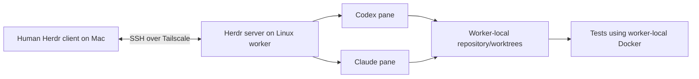

# Herdr on remote machines through Tailscale

Assessed: 3 October 2026. Documentation and source review only.

Herdr is a suitable candidate for human-controlled remote coding. It supplies a
terminal interface, persistent remote panes and agent-status commands. A Linux
worker can run Codex and Claude alongside its own Docker engine, with the
repository cloned on that machine. This removes DinD when the providers run
directly on the worker OS.

Use Herdr as the interface to that worker. Keep SDLC admission, checks, review
and publication policy in a separate manager when those guarantees are required.
Herdr deliberately permits ongoing terminal input and agent prompts; it does not
enforce the earlier requirement to stop an initiating AI harness influencing a
worker after submission.

No Herdr installation, tailnet change, remote connection, provider login or
credential transfer was performed. Herdr was not found on the current PATH. The
trial below is prepared guidance, not a passed runtime test.

## Project and version

The canonical repository is [herdrdev/herdr](https://github.com/herdrdev/herdr).
The older `ogulcancelik/herdr` address redirects there. It is Apache-2.0 licensed.
The latest stable release checked was
[v0.9.3](https://github.com/herdrdev/herdr/releases/tag/v0.9.3), published
29 September 2026, with Linux/macOS ARM64 and x86_64 assets and a Windows x86_64
archive. The similarly named `motionharvest/herdr` repository is a separate fork;
its release numbers are not the upstream version.

Multi-machine UI support arrived in 0.9.0, remote CLI forwarding in 0.9.1 and
machine status/reconnect improvements in 0.9.2. These are released capabilities,
not solely a future feature described on the website.
[Release history](https://github.com/herdrdev/herdr/releases)

The website changes over time. The source reviewed was the v0.9.3 tag, commit
`7b116c05bfda646af39d2524c54e70c751f57ee8`; check the installed client, running
server and integration versions before a trial. Prefer a pinned release asset
for the first run. Herdr checks protocol capabilities, so compatible client and
server versions need not be identical.
[Installation](https://herdr.dev/docs/install/)

## Shape of the setup



Each machine owns its server, sessions, files and processes. The client can show
several machines in one terminal UI. Network loss disconnects the client view;
it does not move those processes onto the Mac. Normal detach keeps them running.
[Remote persistence](https://herdr.dev/docs/persistence-remote/)

This can be a dedicated Ubuntu machine, an Ubuntu VM on another physical host,
or a separate local Colima guest. The first two avoid depending on the Mac's
uptime. A Colima guest still stops if its Mac host stops. Herdr itself neither
creates a VM nor isolates providers from their execution OS. Ordinary rootful
Docker access gives substantial authority over that OS; place an expendable
guest beneath it if the management host needs protection.
[Docker permissions](https://docs.docker.com/engine/install/linux-postinstall/)

### Connecting through Tailscale

Herdr uses SSH to reach a saved machine. Tailscale provides its private network
path; Herdr does not require a public HTTP listener for this connection route.
Two arrangements are possible:

| Arrangement | Authentication |
| --- | --- |
| OpenSSH over a Tailscale address/MagicDNS name | The worker's SSH server authenticates the configured login/key. Tailnet policy must allow network access. |
| Tailscale SSH to a supported Linux worker | Tailscale authenticates and authorises the connection. Policy must permit both network port 22 access and the selected SSH user. |

The second route uses the ordinary SSH client and needs a compatibility test
with Herdr's background connections. Linux workers support its server; native
Windows uses ordinary OpenSSH or a Linux guest for this route.
[Tailscale SSH](https://tailscale.com/docs/features/tailscale-ssh),
[Network grants](https://tailscale.com/docs/features/access-control/grants)

After the human has established SSH access, run these commands on the client:

```sh
ssh -o ForwardAgent=no worker true
herdr machine add worker --remote-session agents --label worker
herdr machine list --json
herdr machine status worker --json
herdr
```

Here `worker` is a placeholder SSH target and `agents` a chosen remote session.
Interactive setup can offer to install or replace the remote Herdr package; it
asks before stopping an incompatible server and its pane processes. Background
reconnects do not perform that installation. A saved profile selects one remote
session, not all sessions on its machine. Removing the profile leaves remote
processes running.
[Connecting machines](https://herdr.dev/docs/connecting-machines/)

A TUI connection can start an already-installed server if it is stopped. The
`machine status` check and remote API commands connect/check without doing that.
Starting a server on connection is distinct from replacing a running server or
providing an unattended boot service.
[Remote startup source](https://github.com/herdrdev/herdr/blob/v0.9.3/src/remote/host.rs)

Use a dedicated worker account. Keep SSH-agent forwarding disabled for this
trial. Herdr does not enable forwarding itself, although its documentation offers
it for remote Git/signing. Our intended setup supplies dedicated worker
credentials separately. A human-owned SSH connection remains a management grant;
its key or equivalent tailnet identity should stay outside an initiating AI
harness if that harness must have limited control.

## Fit with the requirements

| Requirement | Herdr's contribution | What still belongs elsewhere |
| --- | --- | --- |
| Run on remote Linux over Tailscale | SSH-backed remote panes and a combined machine/agent view. | VM provisioning, tailnet policy, worker account and runtime dependencies. |
| Codex and Claude together | Both are supported interactive agents in separate panes. | Install/authenticate providers and their skills/agents on the worker. |
| Implement with one provider, review with the other | Named agents and scripting can sequence prompts and collect output. | Explicit reviewer scope, immutable candidate SHA, rerun checks after changes and enforce publication eligibility. |
| Run Docker integration tests | Shell panes can execute the repository's ordinary test commands against worker-local Docker. | SDKs, Compose, services, configuration and cleanup. |
| Work on one ticket | A wrapper can supply `.sdlc/work/tickets/<number>/ticket-X.md` to an agent. | Capture bounded inputs, exact base, job identity and a fresh implementation branch. Herdr is not the existing SDLC job schema. |
| Signed commits, push and draft PR | Git and `gh` can run inside worker panes. | Provision dedicated credentials and retain the signed/exact-SHA checks. These outcomes are not automatic Herdr guarantees. |
| Return to a human decision | Agent states, notifications, reads, waits and terminal input. | Bound question/checkpoint admission when a durable SDLC decision is needed. |
| Prevent continued commands from the initiating harness | No general saved-machine restriction found that provides this. | Separate identity and grants, or a narrow authenticated manager API. |

Herdr is closer to a terminal multiplexer and orchestration interface than the T3
desktop's structured conversation interface. Both support supervised remote
work and retain ongoing client control. The existing `sdlc` launcher supplies the
ticket/check/review/publication sequence. The offline decision-loop CLI supplies
only a simulated admission/answer cycle. Neither is integrated with Herdr yet.

## Codex, Claude, decisions and status

Herdr detects Codex and Claude from their terminal display. Their official
integrations report native conversation identity for restoration; these hooks
do not turn their status into a structured SDLC acceptance result. Install them
on the worker using its intended provider configuration directories:

```sh
herdr integration install codex
herdr integration install claude
herdr integration status
```

Installation changes provider hook/configuration files. Test it in fresh worker
profiles; preserve existing hooks and verify compatibility with the pinned CLI
versions and loaded skill/agent catalogues. Herdr does not install those
catalogues or authenticate the providers for this workflow.
[Supported agents](https://herdr.dev/docs/agents/),
[Integration changes](https://herdr.dev/docs/integrations/)

After creating panes and naming agents, a controller can use:

```sh
herdr --machine worker agent list
herdr --machine worker agent read implementer --lines 120
herdr --machine worker agent wait implementer --until blocked --timeout 60000
```

IDs/names belong to one server. Always use the same saved-machine selector when
reading or acting on remote IDs; changing the selected UI machine does not
retarget a CLI command. Capture returned pane/workspace IDs rather than guessing
them. Worktree commands are available for separate implementation workspaces.
[CLI routing and worktrees](https://herdr.dev/docs/cli-reference/)

`blocked` means Herdr recognised a question or permission interface. A human can
read it and answer through the terminal or `agent send-keys`. `agent prompt`
refuses an already-blocked agent, but can send a prompt while it is working.
`idle`/`done` indicate readiness for input; they do not establish that tests,
acceptance criteria or publication passed. A timed-out prompt may have been
delivered, so inspect before retrying. This is a useful supervised feedback loop,
not exactly-once job execution.
[Agent automation](https://herdr.dev/docs/agent-automation/)

For the stricter SDLC flow, a wrapper should continue owning its structured
`needs_input` result, immutable checkpoint and admitted answer. Herdr can present
the question and help the human find the right job, while the trusted manager
accepts the response and starts the next attempt. Treat an answer as input data;
do not turn untrusted console text into a command. The existing
[decision-loop design](runner-options-and-feedback.md#when-the-worker-needs-a-decision)
still applies.

Separate panes are not separate Git workspaces or identities. Keep one writer
per implementation worktree. Review a fixed candidate in a separate workspace
or freeze the implementation while it is reviewed. A reviewer under the same OS
account retains that account's permissions unless another boundary is added.

## Persistence, logs and environment values

Detach/network loss preserves live processes while the server and machine stay
up. A server restart ends arbitrary processes. Saved layout and optional native
agent-session restoration reconstruct a session; they do not resume a killed
integration test or prove unattended work restarted successfully. Native agent
restoration depends on installed integrations/session references and occurs after
a client attaches. Boot/service operation needs a separate trial on the actual
worker.

Pane screen-history persistence is disabled by default because output can contain
secrets. If enabled, keep it and provider state outside tracked source. Terminal
history is not a complete job journal: retain manager events, stage exit codes
and provider diagnostics separately.
[Session state](https://herdr.dev/docs/session-state/)

Socket event subscriptions are also non-durable. An overrun requires
resubscription and a fresh authoritative snapshot; they are not a replacement
for the manager's persistent event journal.
[Socket events](https://herdr.dev/docs/socket-api/#event-subscriptions)

Core remote setup does not automatically synchronise provider authentication,
skill catalogues, command plugins or `.env` files. Herdr's own package bootstrap
and explicit clipboard-image transfers are separate capabilities. Provision a
dedicated test environment file separately, using the
[manual SSH transfer procedure](runner-options-and-feedback.md#remote-vm-environment-files).
Load it through the application's supported loader or explicit Compose
`--env-file`; an SSH connection does not transfer `.env` automatically. Neither
an environment variable nor a file hides its value from an authorised Full
access worker. Avoid supplying secrets through prompts or CLI `--env KEY=VALUE`
arguments.

New panes can inherit general server environment credentials. Herdr removes
outer agent-session markers rather than clearing all keys; a fresh pane is not
a fresh credential boundary. Keep the server's launch environment limited and
load repository-specific configuration deliberately.
[Pane environment handling](https://github.com/herdrdev/herdr/blob/v0.9.3/src/pane.rs#L166)

## Authority remains with the client account

Source review found the local API socket uses owner-private permissions. The
remote API bridge connects to that session API using SSH. Accepted requests
include mutating pane and agent operations. Another process with the same worker
identity can control the same session; another process able to use the client's
SSH/tailnet authority can invoke remote operations.
[API server](https://github.com/herdrdev/herdr/blob/v0.9.3/src/api/server.rs),
[Remote bridge](https://github.com/herdrdev/herdr/blob/v0.9.3/src/remote.rs)

A read-only terminal observation stream exists, but choosing it does not remove
the caller's broader SSH/API permissions. Disabling/removing a saved machine is
also not revocation of its SSH or tailnet grant. Tailscale policy can restrict
which identities reach which workers; a permitted general shell/session login
still enables broad control within that account.

If a human and an unrestricted initiating harness share an OS account and its
management credentials, Herdr does not distinguish them. To limit the harness,
keep management and answer authority with a different manager identity. Export
bounded status through a separate interface rather than supplying that harness
with the same Herdr/SSH connection. Hypervisor/worker administrators remain
trusted.

Tailscale SSH has a further limit: any local OS user on an allowed client device
can initiate SSH without a client SSH key. A separate local OS account alone
therefore does not separate the human from an initiating harness on that device.
Use a separately trusted client/device identity and policy, or protect ordinary
OpenSSH credentials under an appropriate account boundary. Tailscale explicitly
cautions against untrusted code on clients with outbound Tailscale SSH authority.
[Client OS-user authentication](https://tailscale.com/docs/features/tailscale-ssh#os-user-authentication-on-the-client)

## Smallest next trial

Start with one disposable Linux worker and a human-operated client. Use generated
ticket/configuration values and no live publication credentials for the first
steps. Do not install phone/web/voice plugins or auto-connect real repositories
as part of this compatibility check.

1. Provision the worker, install a pinned Herdr release and the repository's
   runtime dependencies. Confirm the actual provider and Docker versions. Keep
   Mac shares, host Docker sockets and agent forwarding absent.
2. The human joins the worker to the tailnet and configures the intended SSH
   user/policy. Verify an allowed client can reach it and an unapproved identity
   cannot. Test OpenSSH-over-tailnet first; test Tailscale SSH separately if chosen.
3. Add the saved machine with an explicit session as above. In a remote shell
   pane, start a generated marker process. Detach/disconnect, reconnect and prove
   that the same process/output continued. This step requires no model login.
4. Clone a disposable repository on the worker, capture a generated ticket and
   transfer only a fake test environment file. Run the repository's selected
   Docker/Compose checks using its native Docker engine.
5. After private human authentication, start Codex and Claude in separate panes.
   Verify the worker's actual skills/agents load. Implement a harmless change,
   freeze its candidate SHA and review it through the other provider. Record
   checks independently of Herdr's status indicator.
6. Trigger a supported interactive approval/question UI and verify its detected
   state. A prose question alone may appear as idle rather than blocked. Inspect
   the correct machine/pane and answer deliberately. Prove an automated controller with full
   access can also send input; record this as expected authority, not a failed
   sandbox claim. For restricted admission, test the manager boundary separately.
7. Test a server restart separately from detach. Inspect what ends, what returns
   and whether the native conversation resumes after attachment. Do not assume
   an unfinished check or publication automatically restarts.
8. If proceeding to publication, privately provision dedicated credentials and
   exercise the existing signing/exact-SHA/draft-PR checks. Reconcile any partial
   push/PR outcome before retrying. This is a separately connected trial.

Pass criteria for the first compatibility trial are remote execution, continued
processes after detach, native Docker checks and deliberate human feedback.
Passing those does not establish authenticated SDLC admission, reproducible
resume, safe automatic publication or protection from an authorised manager.
