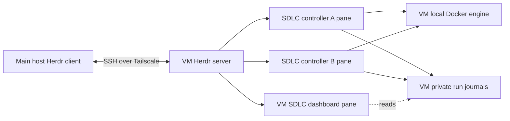

# Herdr as an SDLC driver

Status: proposed approach, researched on 4 October 2026. This document records
capabilities checked in official documentation and source, and recommends an
integration. No Herdr installation, VM connection, provider login or connected
SDLC run was performed.

## Recommendation

Use Herdr as an optional interface to SDLC, with a connected Linux VM as the
first remote execution target. The main host runs the Herdr client; the VM runs
the Herdr server, SDLC controllers, Docker engine and SDLC dashboard. Each run
gets a terminal pane, usually in its own tab. The dashboard can occupy another
tab or a split beside a run.

This is a promising route to driving SDLC from the main host while keeping work
on another machine. It can provide useful remote operation before SDLC has its
own submission service or remote dashboard aggregation. That conclusion is a
design inference from Herdr's persistent remote terminals and SDLC's existing
foreground CLI. Linux execution and the combined workflow still need validation.

Herdr should own layout, terminal input, navigation and notifications. SDLC
should own run identity, captured source, account admission, checks, questions,
publication, review and recovery. Keep ordinary terminal use working when Herdr
is absent. A small SDLC integration and a thin Herdr plugin can improve the
experience without making Herdr a required workflow engine.

## Evidence and compatibility

The latest stable upstream release returned by GitHub during this assessment was
[Herdr v0.9.3](https://github.com/herdrdev/herdr/releases/tag/v0.9.3), published
29 September 2026. Its source commit is
[`7b116c05bfda646af39d2524c54e70c751f57ee8`](https://github.com/herdrdev/herdr/tree/7b116c05bfda646af39d2524c54e70c751f57ee8).
SDLC was assessed at local commit `ba12160`, including the existing signing and
GitHub profile implementation.

Herdr's live stable documentation describes custom resume commands as available
from 0.9.2, while the `docs/next` document within the v0.9.3 source tag says
0.10.0. The tagged schema includes `resume_argv`; that alone does not prove
installation compatibility. Record client, server and plugin versions, inspect
the installed `herdr api schema --json`, and verify required behavior with an
offline fixture. Keep automatic SDLC restoration disabled initially. Apply the
same check before relying on newer popup, startup-hook or agent-view features.
[Stable integration guide](https://herdr.dev/docs/add-herdr-support/),
[tagged next guide](https://github.com/herdrdev/herdr/blob/v0.9.3/docs/next/website/src/content/docs/add-herdr-support.mdx),
[tagged pane schema](https://github.com/herdrdev/herdr/blob/v0.9.3/src/api/schema/panes.rs).

## What Herdr provides

| Capability | Relevance to SDLC | Limit |
| --- | --- | --- |
| Workspaces, tabs and split terminal panes | Group a repository, give each run a tab, and keep an overview or selected-run detail visible. | A pane is a terminal, not a separate account, Git checkout or security boundary. |
| Multiple clients attached to one server | One host window can show the overview while another shows a run. Both view the same underlying processes. | Clients viewing the same tab compete over its pane geometry; viewing a run twice must not launch another controller. |
| CLI and socket operations | Create, label, focus, move and read panes; create layouts with command arguments. | UI IDs belong to one server and can change when panes move. Keep run identity separately. |
| Custom agent lifecycle reports | SDLC can report itself as `sdlc`, with working, blocked and idle states in Herdr's sidebar and waits. | Herdr's agent state has fewer distinctions than SDLC's workflow. It does not certify checks or publication. |
| Display metadata | Show a ticket label, run ID, stage, provider and queue reason through named tokens and custom labels. | Metadata does not change semantic state. Expiry and restart require reconciliation. |
| Notifications | Bring questions, failures and review-ready runs to the human's attention. | Toast delivery is optional; the SDLC journal and dashboard must retain attention items. |
| Plugins | Package launch actions, keybindings, event hooks, link handlers and terminal views. | Plugins run as the user with the user's environment and full Herdr access; they are not sandboxed. Plugin v1 has no native non-terminal UI. |
| Saved SSH machines | Present worker terminals alongside local work and route explicit CLI operations to a selected machine. | Selecting a machine in the UI does not retarget CLI calls. Connection setup does not synchronize SDLC, source or credentials. |
| Persistent server and session restoration | Keep foreground controllers alive across client detach and connection loss; restore layout after a server restart. | Restoring a layout does not preserve a killed controller, check or publisher. Custom restart commands require compatibility and SDLC recovery checks. |

The layout and multiple-client behavior are documented in
[Herdr concepts](https://herdr.dev/docs/concepts/). Pane routing and notifications
are in the [CLI reference](https://herdr.dev/docs/cli-reference/). Custom state
reporting is described in the
[agent integration guide](https://herdr.dev/docs/add-herdr-support/). Metadata,
layouts and subscriptions are described in the
[socket API](https://herdr.dev/docs/socket-api/). Plugin execution and storage are
covered by [Plugins](https://herdr.dev/docs/plugins/); process persistence is
covered by [Session state](https://herdr.dev/docs/session-state/).

For launch commands, distinguish structured arguments from terminal text.
Herdr plugin commands are argument arrays. The socket `layout.apply` operation
can create a fresh tab whose pane contains an argument-array command. Prefer
those routes for generated SDLC launches. `herdr pane run` instead submits
command text and Enter to an existing terminal. It needs deliberate shell
quoting and a known idle shell; it must not submit a launch into an active
controller. Applying a replacement layout closes the old tab after creating
the new one, so do not use layout replacement to refresh active runs.
[Tagged layout documentation](https://github.com/herdrdev/herdr/blob/v0.9.3/docs/next/website/src/content/docs/socket-api.mdx),
[pane command implementation](https://github.com/herdrdev/herdr/blob/v0.9.3/src/cli/pane.rs).

## Remote execution from the main host



Start with a human-controlled SSH connection over Tailscale, an explicit named
Herdr session and one dedicated worker account. Herdr uses SSH for the remote
connection; Tailscale supplies private connectivity. The VM owns its terminals
and processes. Removing a saved machine disconnects its client view without
stopping the remote session. Explicit remote CLI calls use the saved-machine
selector and must fail rather than fall back to Local.
[Connecting machines](https://herdr.dev/docs/connecting-machines/),
[remote persistence](https://herdr.dev/docs/persistence-remote/).

An illustrative client setup, after the worker and SSH access have been
provisioned, is:

```sh
herdr machine add YOUR_WORKER --remote-session sdlc --label YOUR_WORKER
herdr machine status YOUR_WORKER --json
herdr
```

These are Herdr commands, not commands executed during this assessment.
Interactive machine setup can offer an installation or incompatible-server
replacement; review that separately because replacement can end pane processes.

Install SDLC and its runtime beside the VM's local Linux Docker engine. Do not
point the host SDLC installation at an SSH or TCP Docker endpoint: the current
runtime validation rejects those endpoints. Keep SDLC's Docker boundaries,
including the separate daemon per `--docker-tests` check invocation. Remoteness
does not eliminate fixed-port collisions on a shared engine.
[Remote execution foundations](remote-vm-execution.md#current-foundations),
[check isolation](../cli.md#concurrent-runs-and-account-caches).

Use a full repository clone on the VM. Prepare its ignored ticket directory and
project settings there, then run the ordinary CLI in remote panes. Source
capture operates on that VM checkout. Host edits, private ticket files,
instructions, models, environment files and secrets do not arrive automatically.
For the first trial, keep the worker checkout authoritative. A later host-submit
feature needs an explicit snapshot transfer with hashes and bounded inputs; do
not imply that opening a remote tab submits the host's current checkout.

The existing Docker publisher and signing resolver could run on the VM too.
They need their own supported GitHub login and signing configuration there;
Herdr supplies neither. Provision them independently of host desktop state and
validate the current Linux implementation before promising remote delivery.
The first foreground milestone does not require a separate SDLC publisher
service merely because the terminal is remote.
[Publication design](unattended-docker-delivery.md#implemented-boundaries),
[GitHub and signing guide](../github-credentials.md).

### Provider authentication on the VM

Keep this a same-owner workflow using unmodified official provider clients.
Review the proposed account type, repository trust and remote execution mode
before connecting accounts. The current SDLC account route is documented as a
local single-user job and rejects CI; this proposal does not extend that policy
or establish that any subscription can be used as a remote automation service.
Before a connected VM ticket trial, implement explicit execution-mode admission
and document the supported remote route. A reviewed account alone does not
change the current admission policy. Include an API authentication adapter first
where the chosen mode requires it.
[SDLC provider rules](../provider-usage.md).

Official OpenAI documentation describes login on remote or headless machines
through device authentication. Its non-interactive guide recommends API keys
for automation and places conditions on ChatGPT-managed runner authentication,
including excluding public/open-source repositories from that runner workflow.
Remote login support alone does not establish that a particular SDLC job fits
the account-authenticated route. If API authentication is required for the
selected mode, implement an explicit SDLC adapter; the current account-cache
path is not evidence of API support.
[Codex authentication](https://learn.chatgpt.com/docs/auth),
[Codex non-interactive mode](https://learn.chatgpt.com/docs/non-interactive-mode).

Anthropic documents `claude -p` for programmatic execution. Its hosted-product
guidance requires the unmodified client, the applicable terms and each user's
own authentication. Verify the intended personal VM arrangement against the
chosen account's rules before a connected trial. Do not extract subscription
tokens into a custom client or intermediate another user's subscription.
[Claude programmatic execution](https://code.claude.com/docs/en/headless),
[Claude legal and compliance](https://code.claude.com/docs/en/legal-and-compliance).

Herdr sessions do not extend provider capacity. Existing SDLC leases permit one
native operation per provider per installation; Codex and Claude operations can
overlap. Separate host and VM installations do not share those leases. Prefer
one designated execution installation initially and avoid simultaneous use of
the same account from independently coordinated installations. Respect usage
limits without account switching or repeated restarts.

### What the remote session solves

The first remote milestone can use Herdr for terminal transport, navigation and
disconnect persistence. It can postpone an SDLC submission service, custom SSH
job protocol, host-to-worker source transfer and host-side remote status cache.
The dashboard running on the VM sees the VM installation's registered runs and
is visible on the main host through its terminal pane.

That does not create a combined SDLC registry. A host dashboard still sees only
its own installation. Herdr can display dashboards from several machines, but a
single SDLC dashboard aggregating those machines needs the status-source work in
the [remote VM proposal](remote-vm-execution.md#host-dashboard-and-recovery).

Detach or network loss keeps work alive while the VM and Herdr server remain
running. A VM hosted on the main machine still depends on that machine staying
up. A separate host removes that dependency. A VM reboot, Herdr server stop or
controller crash needs SDLC recovery; starting a Herdr service at boot restores
neither the killed process nor a safely reconciled publication operation.
[Herdr session restoration](https://herdr.dev/docs/session-state/).

Human-operated Herdr also retains general terminal control. If an initiating AI
harness must lose control after submission, a shared Herdr/SSH identity cannot
enforce that requirement. Retain the narrower manager identity and authenticated
operations proposed for that case in the
[remote VM design](remote-vm-execution.md#tailscale-and-control-transport).

## The initial working layout

Use one Herdr workspace per repository on each worker, with an Overview tab and
one tab per run. Start with these existing commands inside the selected worker:

```sh
# Overview pane
sdlc dashboard

# Separate run panes, from the initialized worker repository
sdlc run --reference YOUR_REFERENCE --ticket 01-add-api.md
sdlc run --reference YOUR_REFERENCE --ticket 02-add-ui.md

# Optional selected-run detail pane
sdlc dashboard --run RECORDED_RUN_ID --logs
```

The two tickets are layout examples, not approval to execute dependent tickets
concurrently. Multiple SDLC controllers can capture the same normal checkout
into independent workspaces and branches. Keep the source stable while captures
are being taken. Herdr's worktree feature should not be the default launcher:
SDLC currently requires a real `.git` directory and rejects linked worktrees.
[Source capture](../../internal/workrun/source.go),
[run allocation](../../cmd/sdlc/run.go).

All run and dashboard panes must use the same VM user and SDLC installation
state, including the same `SDLC_STATE_DIR` if configured. A second window attaches
to the existing Herdr server and views a different tab; it does not start another
controller for the selected run.
[Dashboard registry](../../cmd/sdlc/dashboard.go),
[installation state](../../internal/runtimeimage/runtime.go).

For questions today, read the selected-run detail, prepare a private UTF-8 answer
file on the VM and explicitly resume the same run. Resume uses the recorded
settings and requires the original repository/reference/ticket context:

```sh
sdlc run --reference YOUR_REFERENCE --ticket 01-add-api.md \
  --resume RECORDED_RUN_ID --answer-file /PATH/TO/PRIVATE_ANSWER.txt
```

Closing the overview leaves controllers running. Closing a controller pane can
interrupt it. Keep pane closure distinct from detach, stop, removal of a worker
connection and resume. Do not automatically close stopped run tabs: their output
and the dashboard are useful for understanding the checkpoint.
[Current foreground behavior](../cli.md#watch-local-runs),
[questions and resume](../cli.md#logs-questions-and-resume).

## Recommended SDLC extensions

### A documented status and launch contract

Reuse `sdlc dashboard --json` initially. It already emits a `version: 1` envelope
with run IDs, stages, liveness, attention, provider/role, queue fields, CI status
and PR URLs. It returns one snapshot; JSON cannot currently be combined with
`--watch`. An adapter can poll at a bounded interval, tolerate unknown fields
within a supported version and reject unknown versions clearly.
[JSON projection](../../cmd/sdlc/dashboard.go).

Document that schema and move it into shared status types before building more
consumers. Add repository/reference filters and a typed detail projection for
bounded questions, findings, check evidence and resume arguments. Those details
currently appear in the terminal view, not the JSON projection. Keep prompts,
transcripts and credentials out of the machine status contract.

Add a separate launch receipt or private status file containing run identity,
installation identity, registration state and controller attempt. Emit it as
part of launch admission so an adapter can bind a pane to the right run without
searching for the newest registry entry. Failed setup must also be observable.
Current stdout mixes an unversioned plan, native JSONL and prose, and the plan
includes publication identity. Do not treat it as a stable integration protocol.
[Launch and reporting](../../cmd/sdlc/run.go).

For remote launch actions, include a caller request ID in the durable receipt
and reject reuse with different inputs. A connection failure can leave the
launch outcome unknown even when work started. Reconcile that request before
retrying; the lock for an existing run does not prevent a duplicate fresh run.

Store mappings privately as installation/worker identity plus run ID, with Herdr
session, workspace, tab and pane IDs as replaceable presentation references.
Reconcile pane moves, reconnects and missing panes. Reuse the worker identity
design from the remote proposal when multiple execution hosts are added.

### SDLC lifecycle in the Herdr sidebar

Implement an optional reporter in the trusted host/VM controller. It activates
only in a validated Herdr context and uses `HERDR_BIN_PATH`, `HERDR_SOCKET_PATH`
and the explicit pane ID. Report as `sdlc`, under a stable source such as
`sdlc:controller`. Do not identify it as Codex or Claude: their headless clients
run in Docker and their session identity is different from the SDLC run.

Use SDLC journal transitions and controller activity as inputs. A proposed
mapping is:

| SDLC condition | Herdr semantic state | Display text |
| --- | --- | --- |
| Active implementation, checks, publication, CI or review | `working` | Current stage and role |
| Controller waiting for a provider lease | `working` | Waiting for provider cache |
| Human question, missing reviewer login or operational failure requiring action | `blocked` while the reporter owns the pane | The specific attention reason |
| Completed review with the draft PR ready for human review | `idle` while the reporter owns the pane | Ready for review |
| Unavailable or stale controller evidence | `unknown` where supported | Interrupted or status unavailable |

This is a proposed projection, not a change to SDLC's state machine. Herdr's
`done` badge includes whether a client has seen a completion; it is not an SDLC
completion state. Keep the exact workflow stage and stopped/heartbeat facts in
metadata and the dashboard.

Use a bounded asynchronous reporter with monotonic sequence numbers across
restarts, discard obsolete pending updates, and ignore display failures. Metadata
tokens such as `sdlc_run`, `sdlc_stage` and `sdlc_wait_reason` should have short
TTLs and explicit clearing. They must not contain ticket bodies, answers or
secrets. Use a stable source rather than allocating a new source for every
update; Herdr limits retained reporting sources.

SDLC often exits when it stops for a question or reaches a checkpoint. Releasing
Herdr lifecycle authority, or returning to the idle shell, clears the tracked
agent. A final blocked report therefore cannot be the durable question queue.
Retain stopped-run attention in the SDLC overview and plugin metadata. A future
SDLC attach/view process could own a persistent status pane if that is useful;
it should observe the run without becoming another controller.
[Lifecycle reporting](https://herdr.dev/docs/add-herdr-support/),
[metadata semantics](https://herdr.dev/docs/socket-api/#agent-state-reporting).

### A thin Herdr plugin

Install the first plugin and adapter on the VM, alongside SDLC. Its launch,
status and answer operations execute there, and its files use VM-local paths.
Herdr's machine bootstrap does not synchronize plugins or their dependencies.
If a later host-side helper operates remote panes, require an explicit saved
machine selector on every forwarded Herdr call and a worker-side SDLC command;
never query host SDLC state while presenting it as worker status.

Package explicit actions to select a repository and eligible ticket, launch a
run, open the overview, show selected-run detail, focus a mapped controller,
open its PR and prepare an answer/resume action. Plugin invocation cwd is its
own package directory, so use the validated workspace context and explicit
repository path when launching SDLC.

A terminal picker or answer editor can use a transient plugin view after its
capabilities are verified. A popup has no normal pane identity or persistent
layout ownership; do not host a long-running controller there. Plugin startup
hooks can restore mappings and display metadata, but they are initialization
commands rather than supervised controller daemons.

Keep config and mappings in Herdr's supplied plugin config/state directories,
with private permissions enforced by the adapter, outside the plugin source and
tracked repository. The plugin may
have the user's full privileges, but should expose narrowly defined SDLC
actions. It should not parse console text into executable commands or call the
provider directly. Start with bounded CLI calls; add socket subscriptions only
if polling is inadequate.

Herdr subscriptions are non-durable. On `events_lost` or reconnect, resubscribe
and read fresh authoritative snapshots. Snapshots and events have no shared
sequence boundary, so events should invalidate cached state rather than blindly
replay over a newer snapshot. Notify only on attention transitions and deduplicate
against notifications already produced by lifecycle reports.
[Plugin contract](https://herdr.dev/docs/plugins/),
[event recovery](https://herdr.dev/docs/socket-api/#event-subscriptions).

### Safer controls and clearer output

Add an answer command that binds a private answer to a run, question/checkpoint
revision and expected attempt, and validates them under the exclusive run lock.
The current answer-file route is bounded and resume prevents competing
controllers, but an answer prepared against an old UI snapshot is not bound to
a question revision. Preserve the existing explicit resume command as a fallback.
[Answer admission](../../cmd/sdlc/run.go),
[controller lock and checkpoint check](../../internal/workrun/runner.go).

Add concise human output for a run pane while retaining native JSONL and full
diagnostics privately. Show stage changes, queue reason, questions, check
failures and PR links. Keep selected-run logs bounded and terminal control
characters removed. A keyboard-selectable overview with repository filters and
actions would improve ordinary terminals as well as Herdr; it should call the
same control interfaces rather than manipulate journals directly.

Complete queue status for all coordinated resources before promising it in the
sidebar. Provider queues are represented today; the tracker currently accepts
Codex/Claude queue names while GitHub lease callbacks also report `github`.
Preserve the existing provider leases, timeout behavior and cancellation rather
than increasing concurrency by separating state directories.
[Queue tracker](../../internal/runstatus/tracker.go),
[controller wait callbacks](../../cmd/sdlc/run.go).

### Recovery and remote aggregation

Share detached launch, attach, stop and restart reconciliation with the existing
[supervision proposal](unattended-docker-delivery.md#remaining-supervision-and-recovery-work).
They should work with any terminal interface. A Herdr resume command should
eventually invoke an SDLC recovery/attach entrypoint that verifies journal state,
exclusive ownership, remaining containers, identity and publication progress.
It must not replay the original fresh-run command or silently answer a question.

Keep automatic restoration off until both the installed Herdr behavior and SDLC
recovery are proven. Herdr custom restore runs after a client attaches; it is not
by itself unattended boot supervision. Add one combined host dashboard only
when required, using the remote proposal's authenticated status sources and
independent connection/error state.

## Delivery order and validation

| Step | Deliverable | Evidence required |
| --- | --- | --- |
| 1 | Linux worker compatibility and manual Herdr layout | Offline SDLC fixture works with VM-local Docker; two run panes and an overview stay distinct; detach/reconnect preserves a marker process. |
| 2 | Supported connected execution route | Account/mode review and explicit remote execution admission implemented, including an API adapter where required; private worker provisioning and explicit authorization for a disposable connected trial; implementation, checks, signing, publication and review validated on Linux. |
| 3 | Status contract and launch mapping | Simultaneous launches map to distinct IDs; failed admission is visible; unknown schema versions fail clearly; status excludes prompts and credentials. |
| 4 | Optional lifecycle reporter and plugin views | Active, queued, stopped, ready and unavailable states display correctly; reporter/socket failure cannot stop SDLC; stopped attention remains discoverable after release. |
| 5 | Answer and navigation actions | Stale answers and duplicate resumes fail safely; moving panes or opening a second client cannot duplicate execution; notifications are deduplicated. |
| 6 | Shared recovery and optional combined dashboard | Restart never creates a fresh duplicate run; unfinished publication and containers are reconciled; unreachable workers retain an explicit unavailable state. |

Keep the first integration tests offline, using disposable repositories,
generated keys and fake status/provider responses. Cover paths with spaces and
apostrophes, simultaneous same-repository runs, provider queue waits, corrupt
registry records, missing panes, pane moves, client detach, server restart,
expired metadata, ambiguous launch responses and dropped subscriptions. Test
controller cancellation separately from closing a dashboard.

Do not install Herdr plugins, connect accounts, transfer credentials or provision
a VM as a side effect of this documentation or an offline test. The first runtime
trial should use a disposable worker and generated marker/status data. Connected
provider and publication trials need their own explicit authorization and the
current provider rules. Successful compilation or layout restoration is not
evidence that a remote ticket reached a reviewed draft PR.

## Related designs

- [Remote VM execution](remote-vm-execution.md) describes SDLC-owned submission,
  snapshot transfer, authenticated controls and combined remote status. The
  Herdr milestone can defer those parts for supervised worker-local operation.
- [Unattended Docker delivery](unattended-docker-delivery.md) owns controller
  supervision and recovery beyond the lifetime of a terminal server.
- [Earlier Herdr assessment](../../research/notes/herdr-remote-assessment.md)
  covers SSH/Tailscale authority, remote persistence and human-controlled coding.
- [Current CLI](../cli.md) and [workflow](../workflow.md) define implemented SDLC
  behavior; interfaces recommended in this proposal remain future work.
