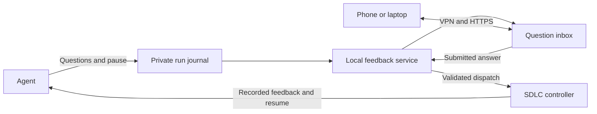

# Private messaging feedback loop

Status: investigation and proposed implementation, reviewed on 6 October 2026.

Build a small private SDLC question inbox, reachable from a phone or laptop over
a VPN. An agent records its questions, SDLC pauses, the owner submits an answer,
and a local service resumes the recorded run. Keep the existing journals and
controller responsible for execution.

If a general chat application is preferred, use self-hosted Zulip with an SDLC
bot. Discord does not provide a supported self-hosted messaging server. Running
its bot locally still sends questions and answers through Discord's service.

## Options

| Option | Hosting | Fit for this feedback loop |
| --- | --- | --- |
| SDLC question inbox | Small local web service, accessed over a VPN | Recommended first implementation. Shows pending questions, accepts an explicit answer and reports execution status without a separate chat stack. |
| Zulip | Self-hosted chat with browser, desktop and mobile clients | Recommended if chat is preferred. A private channel and a topic per run keep conversations together. A bot sends questions and receives replies. |
| Mattermost | Self-hosted chat with REST and WebSocket APIs | Workable when a Slack-style interface is preferred. Needs an SDLC adapter and a separate application/database deployment. |
| Matrix with Element | Self-hosted homeserver and clients, with encrypted rooms available | Prefer when encrypted chat is itself a requirement. An encrypted-room bot needs encryption support, device verification and durable key storage. |
| Discord | Discord hosts messages; the bot can run locally | Technically supports the loop through its Gateway, but does not meet local message hosting. |
| ntfy | Self-hosted notification service with phone clients | Useful for alerts linking to the inbox. Free-text answers and execution state still need the SDLC service. |

Zulip documents a small-server baseline of 1 CPU, 2 GB RAM, swap and at least
10 GB dedicated free disk space. Use its official Docker deployment or a
dedicated Linux VM: the ordinary installer configures several supporting
services. Its real-time API supports long polling, so a local bot does not need
a public incoming webhook.
See [Zulip requirements](https://zulip.readthedocs.io/en/latest/production/requirements.html),
[Docker deployment](https://github.com/zulip/docker-zulip) and
[real-time events](https://zulip.com/api/real-time-events).

Mattermost documents [self-hosted deployment](https://docs.mattermost.com/deployment-guide/server/deploy-server)
and [REST and WebSocket APIs](https://docs.mattermost.com/api/reference/mattermost-api).
Matrix's [encryption guide](https://matrix.org/docs/matrix-concepts/end-to-end-encryption/)
describes the extra client and key-management responsibilities. These options
have not been benchmarked against this workload.

Discord accepts interactions through a Gateway connection or an HTTP endpoint,
but remains in the message path. Its text messages are not end-to-end encrypted.
See [Discord interactions](https://docs.discord.com/developers/interactions/overview)
and [Discord's text encryption statement](https://discord.com/blog/every-voice-and-video-call-on-discord-is-now-end-to-end-encrypted).

## Existing SDLC support

The core pause and answer flow already exists:

- [The runner](../../internal/workrun/runner.go) saves questions in
  `waiting_for_human`, records the pending role and stops the controller. An
  answer becomes recorded feedback. Implementation continues through the saved
  native session; review keeps its existing rules.
- [The run registry](../../internal/runstatus/registry.go) exposes questions,
  checkpoint time and controller activity. Journals remain authoritative.
- [The answer command](../../cmd/sdlc/attention.go) accepts terminal input,
  `--stdin`, `--text` or `--answer-file`, validates a nonempty UTF-8 answer up to
  64 KiB, and dispatches the resumed run. It checks controller ownership and
  freezes the checkpoint while processing the command.
- [Local notifications](../../internal/notify/observer.go) identify attention
  transitions, but send fixed messages without question text. Their in-memory
  deduplication is not a durable delivery queue.

The existing manual equivalent is:

```sh
sdlc dashboard --json
sdlc answer --run FULL_RUN_ID --stdin
```

The second command reads the answer from standard input and resumes the run.
Stdin or a private file avoids putting answer text in process arguments. This
command alone does not bind a remote reply to the question originally shown:
that question could change before the command starts.

## Proposed service and access

Run one trusted feedback service beside the installed CLI. It observes registered
runs, stores question records and answers in private local state, and serves a
responsive browser inbox. Each card shows the project label, work reference,
pending role, exact questions and current status. An explicit **Submit answer
and continue** action sends the answer. Retain the conversation after execution
restarts.



The service keeps listening after the original `sdlc run` exits at a question,
independently of an open dashboard or shell. A later chat adapter can use the
same question records and dispatch operation.

Bind the web service to loopback and expose it through owner-only VPN HTTPS.
[Tailscale Serve](https://tailscale.com/docs/features/tailscale-serve) can proxy
a local port to devices in the tailnet. Keep Funnel disabled for this service
because it permits public access. Tailscale uses an external control plane;
an existing WireGuard VPN is an alternative when that dependency is unwanted.

Use an authenticated owner session, same-origin submissions and CSRF protection.
Trust proxy identity headers only on the configured local proxy path. Escape
question and answer content when rendering it. The browser must have no shell
endpoint, arbitrary file access, Docker socket or provider credentials.
Keep the privileged local dispatcher separate from the browser request handler
and any optional chat container.

Store configuration, answers, receipts and audit records outside tracked
repositories, with private directory/file permissions.

## Answer and recovery contract

Give each question set a durable identity containing the installation identity,
full run ID, pending role, checkpoint and a digest of the questions. Expose an
opaque question ID. A reply identifies that question rather than the latest
message or a short run prefix.

Validate the owner and question against the current journal while holding the
existing controller lock. Reuse the CLI's answer validation and resume preflights.
Extract a common dispatch operation accepting the expected checkpoint. A script
that checks state and then calls `sdlc answer` leaves a race before that command
takes its first snapshot.

Persist submissions before acknowledging receipt. Consume each unique submission
ID as part of the recorded answer transition. Repeated HTTP requests, chat
redelivery and double taps return the existing receipt. Two devices answering
the same question must allow only one accepted answer.

Distinguish **received**, **resuming**, **running** and **could not resume**.
After restart, reconcile submissions against the journal and actual controller
lock. An uncertain launch must not blindly start another controller. Retain
answers when preflights fail and show the recovery action.

Keep answer text literal; do not interpret it as shell commands, file paths or
account changes. Missing source/specification files still need the existing
`sdlc inputs` recovery flow. Provider access failures and usage exhaustion remain
stops under the [provider usage rules](../provider-usage.md).

## Zulip integration

Host the official Zulip stack separately from the SDLC runtime, with persistent
storage, backups and VPN-only access. Create an owner account, a dedicated bot
and a private SDLC channel. Use one topic per run; publish question sets with
their opaque question IDs.

Receive messages through the real-time API. Only the authorised owner's explicit
answer submission may trigger execution. Other conversation, bot messages and
message edits must not resume work. Send accepted answers through the same
validated dispatch operation as the inbox.

Persist message IDs and delivery mappings. Recreate expired event queues and
reconcile message history after reconnecting, including answers sent while the
adapter was offline. Journal state decides whether a reply is still current.
Zulip supplies the conversation UI; SDLC still owns answer acceptance and recovery.

## Phone alerts and host availability

VPN access does not guarantee immediate alerts on a sleeping phone. Start with
browser access, then add optional notifications containing a generic message
and an inbox link. Keep question text out of notification previews.

[Self-hosted ntfy](https://docs.ntfy.sh/config/) supports authentication and
default-deny topic access. Its instant iOS delivery uses an upstream push relay.
[Zulip mobile push](https://zulip.readthedocs.io/en/latest/production/mobile-push-notifications.html)
also uses Zulip and Apple/Google infrastructure. Its current documentation
describes encrypted notification payloads for compatible server/app versions;
verify selected versions and configuration before enabling private-content push.
Fully local operation can disable push and require opening the app.

The local host, VPN and Docker engine must be available to resume work. A sleeping
laptop cannot provide an always-available loop. A home server can host chat, but
running SDLC jobs there is a separate execution change covered by the
[remote VM proposal](remote-vm-execution.md). Remote inbox access does not move
execution to another machine.

## Implementation sequence

1. Build the common question/answer dispatch operation and private inbox. Prove
   an agent pause, owner reply and one resumed controller using offline fixtures.
2. Add service lifecycle and recovery. Own resumed controllers independently of
   browser connections, supervise the service through the operating system, and
   reconcile submissions after a crash or reboot. General detached SDLC
   supervision remains proposed in [unattended delivery](unattended-docker-delivery.md).
3. Enable owner-only VPN access and verify it from a phone and laptop. Add
   optional generic alerts or a Zulip adapter if chat is preferred.

Acceptance should cover stale questions, simultaneous answers, repeated delivery,
an expired chat event queue, failure before and after controller launch, a busy
controller, invalid answer text, unsafe rendered content and an unauthorised
sender. Stale answers leave the current run untouched; closing the browser leaves
accepted work running; a new question creates a new pending record. Offline
fixtures use disposable data and fake providers. A real provider trial requires
explicit authorisation.
