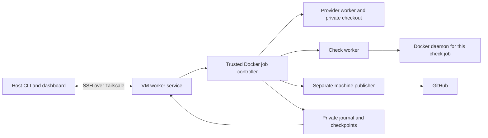

# Remote VM execution

Status: research and proposed implementation plan, reviewed on 4 October 2026.
No remote worker, provider connection or VM provisioning was tested for this
proposal. Commands below describe a proposed interface.

SDLC should support a named Linux VM as an execution target, connected to the
host through Tailscale. The VM should own its running jobs, source snapshots and
recovery state. The host should submit work and show local and remote runs in
the same dashboard. Work should continue when the host sleeps or disconnects.

Reuse the local runtime and the planned detached controller and machine publisher.
Keep the existing Docker daemon per check job for repositories that need Docker
integration tests. A VM removes the need for a local virtualisation layer, but
does not remove collisions between fixed ports on a shared Docker host.

## Current foundations

| Area | Implemented today | Required for remote work |
| --- | --- | --- |
| Installation and runtime | Native CLI installation; a shared image with pinned provider clients, GitHub CLI, Docker CLI and Compose, .NET, skills and agents. | Linux installation and a common bootstrap specification with version checks. |
| Source and inputs | Captured checkout, local source changes, selected ticket inputs and separate check-only files. | Transfer the captured snapshot and its manifest, preserving hashes and provenance. |
| Checks | Disposable check worker; optional dedicated Docker daemon with its own socket, network and data. | Run the same mechanism on the VM, with aggregate resource limits. |
| Provider concurrency | Operations sharing one provider cache queue within an installation. | Preserve VM cache leases and define account admission across host and VM. |
| Provider authentication | Saved native account login and account-status preflight. | Add an explicit supported API authentication adapter if selecting API-backed remote automation. |
| Run reporting | Private journals, exclusive controller lock and activity heartbeat. | VM-owned supervised controllers and portable job identity. |
| Dashboard | Read-only local terminal dashboard and JSON snapshot. | Aggregate remote projections, connection status and bounded remote logs. |
| Publication | Foreground host publisher using host credentials and optional signing. | Reuse the proposed separate publisher and machine credentials for completion without the host. |

The relevant implementation is in [runtimeimage](../../internal/runtimeimage/runtime.go),
[source capture](../../internal/workrun/source.go),
[checks](../../internal/workrun/checks.go),
[provider leases](../../internal/providerauth/auth.go),
[run status](../../internal/runstatus/registry.go) and the
[dashboard command](../../cmd/sdlc/dashboard.go).
Runtime validation currently accepts a local Docker socket or named pipe and
rejects SSH/TCP Docker endpoints. Run SDLC beside the VM's engine; expose SDLC's
control operations through SSH rather than relaxing that engine boundary.

The [unattended Docker delivery proposal](unattended-docker-delivery.md) already
defines detached controllers, a separate trusted publisher, machine signing,
secret resolution and recovery. Remote execution should share those components.
The [onboarding record](../onboarding.md) reports a successful local concurrency
probe: two check jobs each published `18080:8080` and returned different responses
through their own `localhost:18080`. That is evidence for the local mechanism;
the corresponding Linux VM trial remains necessary.

## Execution ownership

Proposed deployment:



Install Tailscale on the host and VM operating systems. Run a small supervised
worker service on the VM that accepts submissions, starts detached controller
containers and projects their status. It must not execute repository commands.
The controller has the engine authority needed to create workers; neither the
provider worker nor the publisher receives the VM's Docker socket.

Start with one account owner, one existing Linux VM and explicit target selection.
VM creation through cloud APIs, automatic scheduling and migration of live provider
sessions can follow later. A running job stays on the worker that accepted it.
Adding another clone or changing a preferred machine does not move it.

Give each worker a stable random identity stored privately on its disk. Record
that identity in every job alongside the run ID, source identity and runtime
manifest. A DNS name or IP address is a connection address, not worker identity.
If a reinstalled VM presents a new identity at an old address, require explicit
registration before submitting or controlling work. Do not duplicate worker
identity when cloning a VM image.

Use the same controller lifecycle for local detached work and remote work. The
host closing a dashboard, forgetting a connection, stopping a job and deleting
a worker must remain separate operations. Full VM completion requires the
machine publisher; an early compute-only milestone may return an artifact to
the host and wait for publication when the host is unavailable.

## Tailscale and control transport

Recommendation: ordinary OpenSSH over Tailscale for the first implementation.
Tailscale supplies private connectivity and MagicDNS names; OpenSSH supplies the
authenticated connection. Tailscale documents this route without exposing SSH
to the public internet. See [SSH over Tailscale](https://tailscale.com/docs/reference/ssh-over-tailscale)
and [MagicDNS](https://tailscale.com/docs/features/magicdns).

Keep administrative bootstrap access separate from routine job access. Provision
a dedicated worker login whose operational key invokes a fixed SDLC transport
command, with no general shell, agent forwarding or unrestricted port forwarding.
That command talks to the service's private Unix socket. Select allowed read or
control operations at registration; read-only dashboard access must not imply
submission or cancellation authority. These restrictions are SDLC work to build,
not capabilities supplied merely by joining a tailnet.

Use a versioned protocol over SSH stdin/stdout, with structured requests and
bounded responses. Transfer user-controlled paths and arguments as data rather
than interpolating them into a remote shell command. Start with snapshots and
bounded log reads; add event streaming using the same protocol. No public HTTP
listener, public tunnel or remote Docker API is needed.

Configure narrow [Tailscale grants](https://tailscale.com/docs/features/access-control/grants)
from the authorised host to the worker's SSH service. Do not grant the worker
general access back to the host or other tailnet machines. Inspect existing
broad rules: adding a narrow grant does not remove access already allowed by
another rule. Keep cloud ingress closed for SSH and application ports, apart
from any separately controlled provisioning route.

Tailscale SSH is an optional simplification for a trusted single-user setup.
It requires network and SSH policy rules and has an important client boundary:
local OS users can use the device's Tailscale identity. The official guide flags
untrusted client workloads and command restrictions as cases where traditional
SSH may fit better. See [Tailscale SSH](https://tailscale.com/docs/features/tailscale-ssh).
Do not enable outbound Tailscale SSH authority from an execution VM to the host.

Workers must not mount Tailscale state, SSH keys or the service socket. Container
traffic can still leave through the VM's network identity. Tailnet grants do not
isolate containers from their own VM or replace Linux network controls. Validate
rules that block worker access to VM administration, other job networks, cloud
metadata and tailnet management destinations, including IPv6. Allow the public
provider and dependency traffic required by the selected mode. Privileged test
daemons limit how strongly this boundary can be enforced against hostile code.

## Replicating bootstrap

Make local and remote setup consume one versioned bootstrap specification.
Every improvement to local setup should either work on both targets or declare
its platform requirement. Avoid a second set of VM-only installation scripts
that gradually diverges from local behaviour.

| Bootstrap item | Proposed VM behaviour |
| --- | --- |
| SDLC CLI and controller | Install a Linux binary and controller from a recorded source revision. Reuse the current native installer initially. Add verified release binaries later; the current installer is not a cross-compilation installer. |
| Outer runtime | Install supported Linux Docker Engine and Compose, OpenSSH, Git and the worker supervisor. Record OS, architecture, kernel, daemon version and storage driver. Go is needed when building SDLC from source. |
| Shared image | Build the existing runtime from the selected revision on the VM initially. Later distribute immutable images for supported architectures. Record image identity and dependency inventory. |
| Provider tools and catalogues | Use the same pinned Codex/Claude clients, skills and agents from the image. Any optional T3 or Herdr adapter gets its own recorded version. |
| Instructions and defaults | Transfer selected shared instructions, model/effort defaults and approved settings as versioned snapshots. Freeze their hashes in each job. Private instructions remain private. |
| Repository setup | Transfer captured source, selected requirements and check definitions. Translate configuration paths into VM-owned paths. |
| Check inputs | Transfer only explicitly selected check-only files, including a root `.env` where configured. Preserve captured bytes; mount them only into the check boundary. |
| Authentication | Run the official provider login on the VM and retain private native caches there. Login is a distinct owner action, never an automatic consequence of bootstrap. |
| Publication and signing | Provision the same machine publisher, vault access and dedicated signing identity proposed for local detached work. Do not depend on the host desktop signing agent. |
| Persistent state | Private worker identity, profiles, journals, source, auth volumes and controlled artifacts outside the tracked SDLC checkout. Set permissions and disk/swap protection deliberately. |
| Connectivity | Register the VM with Tailscale and configure SSH access. Keep enrollment credentials outside images, source, profiles committed to Git and logs. |

Separate desired configuration from observed capabilities. A worker should report
CLI/protocol versions, source revision, runtime inventory, architecture, image
identity, instruction hashes, daemon readiness, free disk and configured job
capacity. Report saved-login status without exporting caches or tokens. Saved
login does not prove model access or authorise a connected validation run.

Installation must be idempotent, with explicit `plan`, `apply` and `doctor`
operations. Repeated bootstrap should preserve state and authentication. Drain
new submissions before upgrades, keep images needed by unfinished jobs and
refuse incompatible resume rather than silently changing tools or instructions.
Do not let background reconnect install or upgrade software.

Parity means the same specification and recorded compatible inventory, not
necessarily the same Docker image ID. An ARM host and an x86 VM need different
platform images. Even builds from the same recipe need not be byte-identical;
freeze the actual VM image in its job. Existing builds also fetch OS packages,
so exact reproducibility needs additional pinning or distributed image digests.

## Source transfer and job admission

Use the existing capture process before transfer. A fresh VM clone alone misses
uncommitted local source, selected ticket documents and captured check inputs.
The host should produce a bounded package containing the required Git objects,
captured source and separate manifests for provider inputs and check inputs.
Do not copy the host checkout, home directory, arbitrary `.git` configuration or
ignored credential files wholesale. Bound transferred refs and objects; an
unrestricted history bundle can contain material absent from the current tree.

Record repository identity, source/base SHAs, captured baseline, branch, input
hashes, instruction snapshot, checks, provider selections, target worker and
runtime requirements. Upload to private staging; validate sizes, hashes, object
references and paths before atomic admission. Reject traversal, symlinks,
unsupported submodules and special files consistently with local capture.
Treat packets and artifacts as private work material, with bounded retention.

Allocate a run ID and submission request ID before transmission. Retain a worker
receipt that maps the request to the accepted run and its manifest hash. If the
reply is lost, inspect that request instead of launching again. Reuse of a
request ID with different content must fail. Concurrent attempts to resume the
same run must contend for one VM-owned controller lock.

Each run gets its own checkout, writable workspace, journal and labelled
resources. A later optimisation can share immutable Git objects or image
layers; it must not share writable repository metadata or working files. Never
mount the same mutable checkout into two sessions. Assign distinct implementation
branches and reject unexpected remote branch movement at publication.

Replace machine-specific paths in exchanged records with logical project/input
identities and worker-resolved locations. VM journals keep VM paths; host origin
paths are descriptive provenance only. The host must not open remote paths as
though they were local, or write its own copy of the authoritative journal.
Artifact retrieval must verify worker/run identity and checksums and extract into
a private destination without executing Git hooks or project scripts.

## Concurrent sessions and ports

Docker inside Docker is needed by execution requirements, not by remoteness.
Two normal worker containers can each run a web server on internal port `3000`.
They collide when both publish that port onto the VM, or when raw processes run
on the VM's network stack. Separate worktrees do not change this.

| Mode | Port behaviour | Proposed use |
| --- | --- | --- |
| Native VM processes | All sessions share host ports and host files unless separated deliberately. | Administrative setup only in the first release. |
| Separate worker containers | Internal ports can repeat; fixed outer published ports still collide. | Ordinary provider sessions and checks without Docker dependencies. |
| Shared VM Docker daemon | Unique Compose projects isolate ordinary resource names/networks; fixed published ports, explicit global names and host networking still interfere. | Future opt-in for repositories with a controlled port/resource contract. |
| Docker daemon per check job | Containers, data and published ports belong to that job's daemon/network namespace. | Preserve the existing mode for Compose, Testcontainers and fixed localhost-port checks. |
| Separate VM per job | Independent host ports and a stronger boundary between jobs. | Later option for repositories needing stronger isolation or incompatible kernels. |

Docker's [project name guide](https://docs.docker.com/compose/how-tos/project-name/)
and [Compose networking guide](https://docs.docker.com/compose/how-tos/networking/)
explain resource naming and the distinction between container and host ports.
Inference for SDLC: changing `COMPOSE_PROJECT_NAME` cannot make two bindings to
the same host address and port succeed. Dynamic host ports or avoiding publication
can support a shared engine, but require applications/tests to accept that contract.

Reuse the check worker that shares its dedicated daemon's network namespace and
talks to its private Unix socket. The inner `18080:8080` belongs to that namespace;
there is no corresponding port published by the outer engine. Keep the per-job
workspace/socket/data volumes, explicit Docker endpoint and labelled cleanup.
Do not mount the VM's Docker socket into model or test containers.

A dedicated daemon remains a privileged container sharing the VM kernel. It
isolates Docker resources and ports but cannot provide hostile multi-tenant
security. Use a dedicated VM and trusted repositories initially. Linux/rootless
daemon alternatives require a compatibility spike before replacing the existing
mode. Docker describes engine authority and namespace limits in
[Engine security](https://docs.docker.com/engine/security/).

Set CPU, memory, process and disk admission limits for the whole job, including
its daemon and nested containers. Keep capacity for the supervisor and status
service. Queue work when capacity is exhausted. Preserve provider cache queues:
two active jobs do not imply two simultaneous turns using the same cache. VM
locks do not coordinate a separately running host installation; account-wide
admission and usage limits need an explicit policy without identity switching.

### Preview access

Treat application previews separately from test port isolation. For an ordinary
worker, allocate a unique outer loopback port or route a trusted proxy to its
private network. For a nested service, use a narrowly configured relay in that
job's network namespace; VM `localhost` is not the nested daemon's `localhost`.
The relay must support applications bound only to job-local loopback.

Expose approved previews through a controlled transport stream or a separate
restricted tunnel. Optional [Tailscale Serve](https://tailscale.com/docs/reference/tailscale-cli/serve)
can publish a proxy privately within the tailnet. A proxy can map run-specific
routes to distinct backends; applications requiring a URL root, WebSockets or
absolute redirects may need distinct ports or hostnames. A tailnet-only URL
still needs the intended reader policy. Bind outer ports deliberately: Docker
publishes unspecified addresses on all host interfaces by default. See
[port publishing](https://docs.docker.com/engine/network/port-publishing/).

Keep preview routes tied to the owning run and remove them on stop. Do not
expose the daemon socket or use Funnel. Current check workers are disposable:
keeping a development server alive after checks needs a separate session mode,
not a promise that an existing check container will persist.

## Host dashboard and recovery

Add a status-source interface with local and remote implementations. Reuse the
existing projected run fields and ordering, then add worker identity/name,
connection state, last successful observation, runtime drift and capacity.
Use `(worker ID, run ID)` as the display/control identity and resolve prefixes
across all workers explicitly. The existing JSON snapshot can start a prototype;
it needs a versioned remote projection for detail, questions and remote log access.

Fetch remote snapshots concurrently with bounded timeouts so one unreachable VM
does not delay local rows or another VM. Cache projections privately. Default
views should keep attention items first and support a worker filter. Include
repository/work reference, branch, stage, provider/model, native usage where
available, PR/current-head CI evidence, queued reason and actionable questions.
Do not manufacture usage figures when the provider did not report them.

Keep transport health separate from controller health. Show `disconnected`
with the last observed stage when the VM cannot be reached; do not infer that
the job stopped. A reachable worker can report a stopped or stale controller.
Use worker-computed heartbeat age and host observation age so clock differences
do not incorrectly classify jobs. Existing local heartbeats are every five
seconds and become stale after twenty seconds; those are useful starting values,
not proof of failure across a network partition.

The dashboard stays read-only initially. Attach, answer, stop and resume should
be explicit CLI control operations. Bind answers to a question/checkpoint ID
and expected journal revision; reject answers to superseded questions. Fetch
bounded sanitized log tails through the worker instead of copying whole native
session stores. Preserve existing terminal-output sanitisation.

Start with authoritative snapshots. If adding streams, assign persistent event
cursors, handle duplicates and detect gaps; reconnect from a cursor or obtain a
fresh snapshot with its boundary. A stream event is not permission to resume
paused work. Use bounded retries with backoff for connection failures, and
surface authentication/access failures without repeatedly restarting jobs.

On host disconnect, accepted jobs continue. On service/controller restart,
reconcile owned containers, locks, journals and unfinished operations before
resuming. A VM reboot can kill a provider or test process: retain interruption
evidence, rerun incomplete checks, and require an explicit safe resume decision
for ambiguous provider turns. Never mark an interrupted stage complete because
its container was recreated. Inspect branch/head and existing PR after a lost
publication response before retrying. Keep policy refusals and human attention
states paused through restart.

## Provider authentication and publication

The current [provider policy](../provider-usage.md) limits account-authenticated
ticket execution to the owner's local native-client job. This proposal does not
extend that permission or remove the CI guard. Implement an explicit execution
and account policy before connected remote onboarding; do not disguise a remote
service as local execution merely because its Docker socket is local to the VM.

Official OpenAI documentation supports remote/headless CLI login through device
codes. It recommends API keys for automation and describes an advanced account
route with trust restrictions, including excluding public/open-source repositories
from that CI/CD workflow. A supported login method does not settle whether a
particular remote SDLC job fits that account route. Use API authentication as the
default proposal for detached remote automation; evaluate any owner-account
exception separately against current guidance. See
[Codex authentication](https://learn.chatgpt.com/docs/auth) and
[non-interactive mode](https://learn.chatgpt.com/docs/non-interactive-mode).

Anthropic permits the unmodified Claude Code binary in hosted infrastructure
under its stated commercial conditions, with each user authenticating for their
own usage. Native `claude -p` is documented. Verify the chosen account, terms and
execution mode; do not collect subscription tokens for a custom client or share
an account. See [legal and compliance](https://code.claude.com/docs/en/legal-and-compliance)
and [programmatic CLI use](https://code.claude.com/docs/en/headless).

Authenticate on the VM through official clients. Do not automatically synchronise
host auth directories or implement token refresh. Keep native caches private to
their provider; expose neither them nor API credentials to check workers or the
publisher. An authenticated provider worker can access its own credentials;
changing authentication type does not make untrusted repository commands safe.
Check the pinned client supports the selected method before provisioning it.

SDLC's current preflight recognises stored account login, and its worker environment
does not forward provider API-key variables. API execution therefore requires
implementation, not just adding a key to a profile: introduce an explicit auth
mode, official-client setup/invocation, mode-aware status checks and protected
secret delivery. Prevent credentials entering Docker configuration, command
arguments, journals or log output. Fail an unsupported mode rather than falling
back to account login. Test with fake credentials and network-disabled clients;
the connected route must also satisfy the documented restriction against running
untrusted code with an API key in its environment.

Use the same separate publisher as local detached delivery. It receives only a
validated bundle, frozen publication manifest and narrow publication state. Resolve
machine credentials and signing inside that boundary. Provision secrets through
the supported machine route, with durable protected bootstrap storage; the VM
must not require desktop approvals on each run or inherit a personal SSH agent.
Keep tested/published tree equality and exact repository/branch/head validation.
Expiry, revocation, provider refusal and usage exhaustion must pause visibly.

## Lessons from T3 Code and Herdr

These are verified behaviours from official project documentation, followed by
proposed SDLC applications. They do not establish SDLC compatibility or approval
for provider accounts.

| Project evidence | Proposed SDLC application |
| --- | --- |
| T3 Code stable v0.0.45 documents desktop-managed SSH remote servers/forwards and direct Tailscale access. Its remote launcher installs its own runtime; provider CLIs and provider credentials belong on the remote machine. [Remote access](https://github.com/pingdotgg/t3code/blob/v0.0.45/docs/user/remote-access.md) | Saved worker connections and an explicit readiness check. Transport bootstrap is only part of SDLC provisioning. |
| T3 environments own execution, files and durable state; environment identity persists separately from endpoints. [Remote architecture](https://github.com/pingdotgg/t3code/blob/v0.0.45/docs/internals/remote.md) | Stable worker identity and worker-owned jobs. Repository identity can correlate clones without moving a live run. |
| T3's Linux background service uses systemd user services and lingering; updates can interrupt active work. [Background service](https://github.com/pingdotgg/t3code/blob/v0.0.45/docs/user/background-service.md) | Supervise the VM worker independently of SSH login. Drain before upgrades and reconcile interrupted work. |
| Herdr saved machines appear alongside Local; connections target named sessions and reconnect with backoff. Its bootstrap does not replicate local executables, plugins, configuration or secrets. [Connecting machines](https://herdr.dev/docs/connecting-machines/) | Combined dashboard with machine labels and independent connection failures. SDLC owns bootstrap parity. |
| Herdr detach keeps panes running; named sessions have separate runtime state. Snapshot restoration does not preserve arbitrary running processes after server restart. [Persistence](https://herdr.dev/docs/persistence-remote/), [session state](https://herdr.dev/docs/session-state/) | Distinguish disconnect from interruption and workflow recovery. A terminal session is not a port or security boundary. |
| Herdr socket events are non-durable and can report lost events. [Socket API](https://herdr.dev/docs/socket-api/#event-subscriptions) | SDLC journals and authoritative snapshots must remain the source for workflow recovery. |

The stable references checked were T3 Code
[v0.0.45](https://github.com/pingdotgg/t3code/releases/tag/v0.0.45) and Herdr
[v0.9.3](https://github.com/herdrdev/herdr/releases/tag/v0.9.3). Herdr website
documentation can change independently of a release; verify installed API/CLI
compatibility during a trial. The earlier
[Herdr assessment](../../research/notes/herdr-remote-assessment.md) supplies
additional context, with historical conclusions subject to fresh verification.

Treat both tools as optional interfaces for humans after the worker contract
exists. Neither cited design establishes automatic VM provisioning, replicated
SDLC setup or isolated Docker ports. Opening their UI does not automatically
attach it to an SDLC headless job or transfer SDLC's checks/review/publication
guarantees. An adapter must reconcile ownership and provider cache leases.

## Proposed interface

Illustrative commands, not implemented commands:

```sh
sdlc worker add YOUR_WORKER --ssh YOUR_WORKER_SSH_ALIAS
sdlc worker bootstrap YOUR_WORKER --plan
sdlc worker bootstrap YOUR_WORKER --apply
sdlc worker doctor YOUR_WORKER
sdlc run YOUR_WORK_REFERENCE --worker YOUR_WORKER
sdlc dashboard --worker all
sdlc run attach YOUR_RUN_ID --worker YOUR_WORKER
sdlc run stop YOUR_RUN_ID --worker YOUR_WORKER
sdlc run resume YOUR_RUN_ID --worker YOUR_WORKER
```

`worker add` registers an existing VM, not a cloud account. Keep connection
profiles in private installation state. Bootstrap applies only an explicit
versioned plan. Provider login and machine credential provisioning remain
separate steps. Exact command syntax should follow the local detached-run
interface when that interface is settled.

## Implementation order and validation

| Iteration | Work and likely modules | Completion evidence |
| --- | --- | --- |
| 1. Shared job lifecycle | Complete separate publisher and detached controller from the existing proposal. Introduce an executor contract around submit, status, logs, artifacts, stop and resume; adapt the local path first. | Launcher closure does not stop work; offline restart and publication reconciliation pass. |
| 2. Bootstrap parity | Add common bootstrap manifest and Linux worker plan/doctor. Extend `internal/runtimeimage`, installation, instructions and private settings. | Repeated setup preserves state; tool/configuration drift is reported; unfinished jobs retain their images. |
| 3. Remote transport and capture | Add `internal/executor` and `internal/worker`, SSH transport and supervised service. Extend `internal/workrun` manifests/journals and `cmd/sdlc/run.go`. | Network-disabled fake transport proves atomic import, hostile-path rejection, identity/version checks and lost-submit idempotency. |
| 4. Host visibility | Add status sources and private remote cache in `internal/runstatus`; extend `internal/dashboard` and `cmd/sdlc/dashboard.go`. | Local/remote runs appear together; an unreachable VM does not block others; cached state, clock skew and bounded logs are handled. |
| 5. VM concurrency | Reuse `DockerChecker` isolation; add capacity controls, preview routing and owned cleanup. | Two runs of the same repository overlap, reuse the same fixed inner port and retain distinct files, responses, volumes and cleanup. |
| 6. Remote authentication | Review execution/account policy and add supported auth modes in `internal/providerauth` and worker secret delivery. For API mode, add explicit setup/status/headless adapters before accepting remote jobs. | Offline tests reject unsupported modes and account fallback, validate secret separation and preserve refusal/usage-limit stops. |
| 7. Connected onboarding | Provision the selected supported credentials and run a disposable private-repository trial with the owner. | Host disconnect, signed publication, CI, independent review, repair and safe restart all work without recurring desktop approvals. |

Iterations 2 to 5 can use offline fixtures and credential-free VM checks while
publisher work proceeds. Only describe end-to-end unattended delivery as complete
after iteration 1 and the connected acceptance trial both pass. Provisioning a
VM or connecting a real provider is separate authorised work, not part of this
research iteration.

Failure coverage must include partial uploads, duplicate requests, corrupt
snapshots, lost event cursors, a VM replaced at the same address, host sleep,
VM/controller reboot, competing resume attempts, stale human answers, late
cancellation, disk exhaustion, runtime upgrades and lost push/PR responses.
Stop one run while a second remains active and prove cleanup affects only owned
resources. Verify worker network restrictions and secret mounts separately from
the port test. Use disposable fake credentials only in offline fixtures.

Choose initial VM capacity from measured workload demand. A pair of .NET builds,
databases and nested image builds can consume substantial memory and disk; no
VM size or cloud-price estimate was validated here. Record peak use during the
concurrency trial before choosing admission limits. Keep automatic shutdown out
of the first release so it cannot discard pending attention or recovery state.

The first useful milestone is one registered VM over Tailscale, matching runtime
setup, credential-free concurrent checks and host dashboard visibility. Complete
provider work and independent publication follow once account policy and the
shared detached delivery components are ready.
