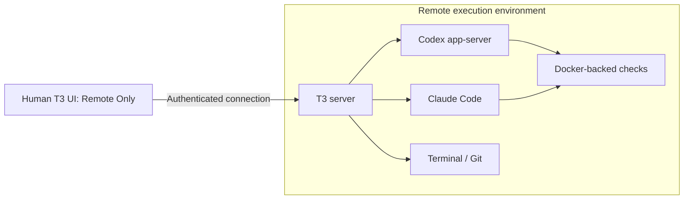

# Docker workers, credentials and remote execution handoff

Updated: 2 October 2026.

This is the current continuation document. It records the implemented Docker
compatibility spike, subsequent credential and runtime research, and the latest
proposal to simplify the trust model. A full Colima worker runtime trial passed
using portable tools, generated credentials and simulated provider/API responses;
see [the trial report](colima-trial.md).
No global runtime installation, secret store, T3 service or remote host was added.

For the subsequent runtime comparison, CLI onboarding proposal and paused-job
feedback spike, read [execution options and a decision loop](runner-options-and-feedback.md).
That spike is an offline simulation; it does not add continuation to the Docker
runner or establish a separate human authority.

The operator subsequently challenged retained host management access. Read the
[host control handoff](host-control-handoff.md) for that finding and the next
proposed two-account test. It updates the continuation below: trusting the
initiating controller is no longer an assumed final decision. The control
boundary test is proposed, not completed.

The older [protected runner handoff](protected-runner-handoff.md) preserves the
earlier service-boundary investigation. Its gate 0 plan is not automatically the
next action under the simpler proposal below. Read this document first.

## Latest proposal and its limits

The operator is considering a disposable Docker worker with credentials supplied
at launch. It clones its own repository, receives ticket inputs, and runs the
coding agent with Full access. Docker-in-Docker is required for integration
tests. The operator specifies no mounts apart from credential injection.

The practical interpretation for a trial is **no host filesystem bind mounts and
no host Docker socket**. Repository, ticket and output files belong to the
execution environment. Ticket bytes must be transferred into it rather than
exposing the initiating checkout. If the requirement also prohibits internal
Docker volumes, the current sidecar arrangement must change; its workspace and
socket volumes are mounts too. Do not silently treat this distinction as settled.

The initiating host may retain management access. Any controller retaining a
Docker API, Sandbox management, SSH or T3 operation grant can continue issuing
commands. That capability fits a model that trusts the controller; it does not
show that the worker protects itself from that controller. A host does not retain
this capability merely because it initiated a job: the management grant must
remain available. Revoking access is a separate
operation from supplying credentials once.

The intended benefit is containment of ordinary worker mistakes and filesystem
operations. A worker without host bind mounts has no ordinary mounted path to
unrelated host files. Writable bind mounts would permit host-file modification
and deletion. [Docker bind mounts](https://docs.docker.com/engine/storage/bind-mounts/)

**The Docker-in-Docker privilege requirement prevents a blanket host-safety
claim.** Conventional rootful DinD uses a privileged daemon container. Docker
documents that privileged containers receive all capabilities and host-device
access, and are not securely sandboxed. No host bind mounts does not remove those
privileges. On native Linux, this concerns the machine's kernel and devices; on
Docker Desktop, the immediate boundary is its Linux backend VM. Do not describe
that as either automatic access to the desktop OS or proof that desktop files are
safe. The documented rootless DinD example still requires outer privileged mode.
[Privileged containers](https://docs.docker.com/reference/cli/docker/container/run/#escalate-container-privileges---privileged),
[Rootless DinD](https://docs.docker.com/engine/security/rootless/tips/#rootless-docker-in-docker)

Full access is the coding agent's permission mode. It does not itself require
Linux root, host namespaces or Docker privileged mode. The current coding worker
is non-root; its separate test daemon is privileged.

The non-root worker can control that daemon and request privileged nested
containers and daemon-visible mounts. Its user ID does not restore strong
containment for this pair. This is separate from access to the initiating host's
Docker socket, which the current worker does not mount.

A private microVM containing the agent and its own Docker engine is a stronger
candidate for the filesystem-containment goal. Docker Sandboxes provides this
shape. A dedicated remote VM also separates execution from the initiating
machine. Neither prevents a trusted manager from entering the worker.
[Docker Sandbox isolation](https://docs.docker.com/ai/sandboxes/security/isolation/)

Containment also depends on network services, delegated credentials and output
handling. A worker can use permissions it receives to change remote repositories
or services. Do not expose an unauthenticated host control service, host-side MCP
execution or broad forwarding as an alternative route to host authority. Treat
exported scripts, hooks and other executable output as untrusted until reviewed.

## Operator requirements and restrictions

- Pick up a repository-relative ticket at
  `.sdlc/work/tickets/<number>/ticket-X.md`.
- Clone the remote base into an isolated execution workspace. Local source edits
  are not the initial implementation state. Explicit ticket inputs need separate
  capture because they may not exist in the remote repository.
- Run build and integration checks that themselves use Docker and Compose.
- Support Codex and Claude, including implementation by one and review by the
  other. Both need their skills and agent catalogues in the execution environment.
- Run unattended after bootstrap, create worker-signed commits, push those exact
  commit IDs and finish with a draft PR. No automatic merge or deployment.
- Keep actual account settings, supplied work, logs, authentication and credentials
  out of this public repository. Use generic examples in tracked documents.
- Do not request access to the operator's vaults, service-account tokens, secret
  exports, existing key inventories, agent sockets or sensitive command output.
  The human performs real credential provisioning privately. Assessment work uses
  disposable keys and fake values.
- Keep the setup simple. A commercial vault is not a dependency. The operator
  expressed interest in open-source alternatives, including gopass.

The earlier goal included blocking commands from the outer harness after
admission. The simplified Colima trial trusted that controller and focused on
worker-to-host containment. The operator has now asked how to test the earlier
control requirement. First test a manually admitted job with management owned by
a separate OS account; a submission-only service is later work if that boundary
passes. Protection from the host administrator is outside the local VM design.

## What is implemented in this repository

The [Docker ticket runner](docker-ticket-jobs.md) and
[container onboarding](container-onboarding.md) describe the existing spike.

- `scripts/sdlc.py run` captures one selected ticket and bounded linked Markdown,
  creates a fresh job workspace and starts the worker.
- The runtime includes Codex, Claude Code, GitHub CLI, .NET 10, Docker/Compose and
  pinned public skill/agent catalogues.
- Implementation, checks, independent-session review and fixes are sequenced
  within a bounded review loop. Either provider can fill either role.
- The worker verifies signing/account expectations and pushes the reviewed SHA
  unchanged, using an absent-ref lease for the new branch, then creates a draft
  PR. These checks are not an independent security gate against a worker able to
  alter its own runtime.
- `--docker-tests` starts a per-job DinD sidecar. Worker and daemon share job
  workspace storage and networking so Compose bind paths and localhost test
  endpoints work. This uses internal volumes and a privileged daemon.
- Provider authentication and failed-job output can persist in named volumes.
  The test daemon and its data/socket volumes are removed on normal completion
  or handled cancellation. Abrupt termination can leave resources.
- The unattended route starts no SSH service. The optional interactive SSH route
  is separate.
- `cli --provider codex|claude` selects the requested CLI.
  `auth-status --provider codex|claude` checks stored provider authentication
  without supplying GitHub or signing credentials or starting model work.
- The image reserves T3 state storage but does not install a T3 server. Existing
  documentation treats the T3 connection as an unproved integration.

Historical implementation commits are `979c98a` (initial spike/handoff) and
`addb55a` (refreshed Codex/Claude onboarding). They do not establish the later
protected-service or Sandbox designs. Check the current Git state when resuming;
this document is not an instruction to push or publish changes.

**The latest no-mount proposal is not yet implemented.** Current job inputs and
runtime helper overlays use host bind mounts, the job uses named volumes, and
provider state persists. Do not claim the existing launch already satisfies the
stricter proposal merely because it does not mount the host repository or Docker
socket.

## Credentials: storage, injection and lifetime

These are separate questions:

| Question | Current evidence |
| --- | --- |
| Are credentials built into the image? | The build context is allowlisted and excludes credentials and target work. |
| Does supplying them once make them single-use? | No. A PAT or private key remains usable for its normal lifetime. |
| Can the worker read supplied credentials? | Yes. The current worker receives a raw signing key and GitHub token. |
| Is current injection memory-only? | No. Environment-backed Compose secrets are copied into the container filesystem. |
| Does removing a container revoke a token? | No. Revocation or expiry is separate; copied values may survive elsewhere. |
| Does a secret store enforce the Docker control boundary? | No. It controls storage/retrieval, not authority over the execution environment. |

The launcher reads private credential files, puts their bytes into its Compose
environment, and the credential overlay supplies `/run/secrets` files. The
entrypoint exports the GitHub value as `GH_TOKEN`. `/run/sdlc` is tmpfs, but
`/run/secrets` is not configured that way. The inspected Compose 5.1.2 source
uses `CopyToContainer` for environment-backed values.
[Credential overlay](../runtime/compose.credentials.yaml),
[Compose implementation](https://github.com/docker/compose/blob/v5.1.2/pkg/compose/secrets.go)

The signing wrapper uses the private file and removes `SSH_AUTH_SOCK`; it does
not use a forwarded personal SSH agent. A Full access worker can copy supplied
values into logs, retained state or commits. A future tmpfs injection path would
reduce filesystem persistence, but would not stop copying or guarantee secure
erasure; tmpfs contents can also be swapped.
[Signing wrapper](../runtime/bin/ssh-sign-file),
[tmpfs behaviour](https://docs.docker.com/engine/storage/tmpfs/)

Prefer dedicated automation credentials with limited repository permissions and
expiry. A GitHub App can mint selected-repository installation tokens with
one-hour expiry and explicit revocation. The current user-PAT preflight expects
`gh api user`, so App support needs implementation. Worker publication must still
preserve its signed commit IDs.
[GitHub installation tokens](https://docs.github.com/en/apps/creating-github-apps/authenticating-with-a-github-app/generating-an-installation-access-token-for-a-github-app)

No real vault access or credential export was performed in the credential/runtime
research. Do not turn that research into a request for the operator's secrets.

## Secret-store research and outcome

| Option | Useful role | Limit for this work |
| --- | --- | --- |
| 1Password CLI | Runtime retrieval through `op read`, `op inject` or `op run`; service accounts can target dedicated vaults | Commercial dependency; normal desktop CLI authorisation is account-scoped; retrieval exposes plaintext to the consuming process. A service-account token is another secret to protect. |
| gopass | Open-source global encrypted local store, normally GPG with Git storage | Its threat model assumes no local attacker. Decryption authority and GPG cache expiry need separate treatment for unattended work. |
| SOPS + age | Encrypted configuration without a server | Decrypted environment/files are accessible to the consumer; no Docker or signing-policy boundary. |
| OpenBao | Open-source policy-based service, AppRole identities and expiring/use-limited credentials | Adds TLS, persistence, unseal, backup and service-operation work. A protected signing/delegation design needs adapters; a simple worker can use human-provisioned raw credentials. |
| Infisical / AgentVault | Secret management; AgentVault is a separate preview HTTP-brokering candidate | Main-product dynamic secrets have commercial licensing requirements. AgentVault compatibility and operation restrictions need testing; it is not a Git SSH-signature service. |

Sources: [1Password service accounts](https://www.1password.dev/service-accounts/get-started),
[1Password CLI authorisation](https://www.1password.dev/cli/app-integration-security),
[gopass security](https://github.com/gopasspw/gopass/blob/master/docs/security.md),
[GPG cache options](https://www.gnupg.org/documentation/manuals/gnupg/Agent-Options.html),
[SOPS](https://github.com/getsops/sops),
[OpenBao policies](https://openbao.org/docs/concepts/policies/),
[OpenBao AppRole](https://openbao.org/docs/auth/approle/),
[Infisical licensing/features](https://infisical.com/docs/documentation/platform/dynamic-secrets/overview),
[AgentVault](https://github.com/Infisical/agent-vault).

An operator-run OpenBao lab was described using only fake secrets, one exact
read-only KV path and a short-lived AppRole. It was guidance, not an executed
test or installed dependency. The operator then rejected the amount of
bootstrapping relative to the simple-worker goal. Do not resume by installing a
vault service. Choose the execution boundary first; secret storage can remain a
human-owned provisioning detail.

## OrbStack and open-source local VMs

The operator uses OrbStack, not Docker Desktop. OrbStack's machines and Docker
containers share one Linux VM and kernel. A separate OrbStack machine therefore
does not supply an independent guest-kernel boundary. Privileged DinD can threaten
the shared Linux environment; that does not mean automatic control of macOS.
[OrbStack architecture](https://docs.orbstack.dev/architecture)

Current documentation offers `orb create --isolated --isolate-network`.
Isolated machines disable Mac filesystem sharing, Mac command integration,
default SSH-agent forwarding and device passthrough. Network isolation also
blocks other machines and host IPs. OrbStack explicitly says these machines are
not a full security boundary and recommends a VM with its own kernel for code
attempting escape. Availability in the installed version was not checked.
[Isolated machines](https://docs.orbstack.dev/machines/isolated)

Open-source tools that can host a separate Linux VM and its Docker engine:

| Tool | Fit for this worker |
| --- | --- |
| [Colima](https://github.com/abiosoft/colima) | Docker-ready CLI built on Lima. Each named profile is an independent VM. |
| [Lima](https://lima-vm.io/docs/) | Direct VM configuration and provisioning. Plain mode disables host mounts, SSH-agent forwarding, dynamic port forwarding and guest-agent conveniences; Docker needs guest provisioning. |
| [UTM](https://mac.getutm.app/) | GUI for QEMU or Apple Virtualization; create a Linux VM and install Docker with sharing disabled. |
| [Multipass](https://github.com/canonical/multipass) | CLI for disposable Ubuntu VMs; provision Docker in the guest and avoid host directory mounts. |

The tested local shape is a dedicated Colima worker profile alongside OrbStack.
Current Colima documents `mounts: null` to disable host mounts,
`forwardAgent: false` to avoid agent forwarding and `autoActivate: false` to avoid
switching the default Docker context. Its source distinguishes `null` from an
empty list, which selects the home-directory mount. Pin and verify the chosen
version before using this as a security setting.
[Profiles](https://colima.run/docs/profiles/),
[Configuration](https://colima.run/docs/configuration/),
[Mount handling](https://github.com/abiosoft/colima/blob/main/config/config.go#L728),
[Lima plain mode](https://lima-vm.io/docs/config/plain/)

The intended layout is macOS, then a dedicated Linux VM, then the worker and its
DinD test daemon. Treat the whole guest as disposable: privileged DinD can
compromise that guest, while the VM adds the boundary to macOS. Keep ticket
inputs, clones and runtime state inside the guest. Removing Mac shares does not
resolve the stricter requirement to remove mounts between the guest and worker.
The full trial copies inputs/helpers rather than binding guest directories; the
normal Docker job launcher still has its existing binds. Internal named workspace,
socket and data volumes remain in the trial.

The [live Colima trial](colima-trial.md) subsequently passed with portable Colima
0.10.3, Lima 2.2.0 and a supported local Docker VM image. Guest checks found no
Mac sharing mounts or forwarded SSH agent; a generated Mac canary was
inaccessible. Privileged DinD, nested Compose HTTP/networking, inner volume modes,
a copied-source .NET 10 build and fake-token tmpfs injection passed. The SDK ran
in a nested container, not the coding worker image. The disposable VM, data disk
and owned containers were removed; no real credentials or provider calls were
used.

The subsequent full worker trial built the actual runtime image and passed all
132 offline tests inside it. Real Codex/Claude CLIs reported unauthenticated;
their pinned skills and agents were available. Both implementation/review orders
passed sequentially with simulated provider responses and draft-PR API operations.
The runner actually cloned a disposable local repository, created a branch,
signed a commit, verified the reviewed SHA and pushed it to a local bare remote.
Nested Compose build/relative bind/localhost checks and the worker's installed
.NET 10 SDK passed in both jobs. Generated credentials were streamed into runtime
tmpfs after image creation. No guest-directory or guest outer Docker-socket binds
were present in the worker or DinD daemon. Cleanup removed the VM and data disk.
This is runtime compatibility evidence, not an escape-resistance test, real model
implementation or real GitHub publication.

Colima supports Linux too, but the host trial launcher currently targets Apple
silicon macOS. Researched Windows equivalents include Multipass with its released
Hyper-V/VirtualBox backends, a dedicated Hyper-V Linux VM, VirtualBox and QEMU.
Lima's Windows support needs its own trial. WSL automatic-mount settings do not
prevent guest root manually mounting Windows drives. The [Windows comparison](colima-trial.md#windows-equivalents)
records version qualifications and host-sharing controls; no Windows runtime was
tested here.

## Docker Sandboxes assessment

Current Docker Sandboxes uses the separate `sbx` CLI. Local sandboxes run an agent
in a microVM with its own Linux kernel and Docker engine. Docker documents both
Codex and Claude templates, including permission-bypass defaults. This can avoid
maintaining the current privileged DinD arrangement on the initiating machine.
It is not an ordinary container-only runtime.
[Sandboxes](https://docs.docker.com/ai/sandboxes/),
[Codex template](https://docs.docker.com/ai/sandboxes/agents/codex/),
[Claude template](https://docs.docker.com/ai/sandboxes/agents/claude-code/)

The agent-run assessment actually checked:

| Check | Result on 2 October 2026 |
| --- | --- |
| Apple silicon/macOS platform prerequisites | Passed. |
| Standalone `sbx` availability | Absent. |
| Existing Docker CLI | 29.4.0; no legacy Sandbox plugin listed. |
| Disposable Compose fixture | Configuration parsed. |
| Prepared shell trial | Bash syntax check passed. |
| Live Sandbox, nested containers, model execution | Not run. |

No Sandbox installation, Docker OAuth, secret inventory, paid model call or
container launch was performed by this assessment. The disposable fixture lived
outside the tracked tree and is not a durable dependency of this handoff.
Current `sbx` requires installation and Docker sign-in; Docker Desktop/Engine is
not itself a prerequisite.
[Installation](https://docs.docker.com/ai/sandboxes/install/)

A later shell-only trial should check an inner Compose service on localhost,
read-only and writable inner bind mounts, container-to-container networking, a
.NET 10 build and cleanup of only owned resources. A nested SDK-container build
would not prove the agent environment itself contains the SDK. Provider execution,
catalogue loading, signed publication and host containment remain separate checks.

Defaults require review before a no-host-mount trial: shared skills can be
mounted, SSH-agent forwarding is enabled, and an MCP gateway may expose host
integrations. Mountless mode avoids a host workspace, but does not automatically
remove other shared resources. Clone mode still exposes ignored and untracked
files in the supplied repository for reading. Host-side proxy management can keep
provider/GitHub token bytes outside the VM; it does not prevent use of their
granted authority. `sbx exec`, including root execution, preserves the manager's
ability to enter the sandbox.
[Credential settings](https://docs.docker.com/ai/sandboxes/configuration/credentials/),
[MCP gateway](https://docs.docker.com/ai/sandboxes/mcp-gateway/),
[Management command](https://docs.docker.com/reference/cli/sbx/exec/)

## How T3 Code and remote execution work today

T3 has a local UI and an execution server. The environment containing that server
runs provider processes, Git, worktrees and terminal shells. Codex is a child
app-server process; Claude uses the Agent SDK with a configured executable and
working directory. Both providers can be configured in one environment. Full
access maps to their permission-bypass settings.
[Remote architecture](https://github.com/pingdotgg/t3code/blob/main/docs/internals/remote.md),
[Codex runtime](https://github.com/pingdotgg/t3code/blob/main/apps/server/src/provider/Layers/CodexSessionRuntime.ts#L508),
[Claude adapter](https://github.com/pingdotgg/t3code/blob/main/apps/server/src/provider/Layers/ClaudeAdapter.ts#L4725)

Remote Only mode disables the desktop's local server and agents. Pairing,
Tailscale, SSH and T3 Connect offer connection routes. Tailscale is useful for
private reachability; its network policy and T3's client authorisation are
separate controls. Application pairing over a private network does not require
giving the desktop a general SSH shell. It also does not place provider processes
inside Docker.
[Remote access and Remote Only](https://github.com/pingdotgg/t3code/blob/main/docs/user/remote-access.md)

A normal paired client has broad control, including provider prompt dispatch and
terminal operations. Narrower scopes exist, but there is no fixed-ticket
submission-only scope. Removing terminal scope does not remove provider-prompt
scope. T3 read access can include absolute files readable by the server account,
so project/worktree boundaries are not filesystem isolation.
[Auth scopes](https://github.com/pingdotgg/t3code/blob/main/packages/contracts/src/auth.ts#L77),
[RPC authorisation](https://github.com/pingdotgg/t3code/blob/main/apps/server/src/auth/RpcAuthorization.ts#L23),
[Filesystem boundary](https://github.com/pingdotgg/t3code/blob/main/docs/internals/environment-auth.md#the-environment-is-the-filesystem-boundary)

The desktop encrypts its saved connection catalogue through Electron safeStorage
and refuses writes when encryption is unavailable. On macOS, Electron documents
Keychain protection from other applications without user override; Windows and
Linux have different semantics. Do not assume the catalogue is a plaintext token
file. This is useful evidence for a human-owned UI, not proof against every local
control, IPC, SSH, accessibility or administrative route.
[Catalogue storage](https://github.com/pingdotgg/t3code/blob/main/apps/desktop/src/app/DesktopConnectionCatalogStore.ts#L365),
[Electron safeStorage](https://www.electronjs.org/docs/latest/api/safe-storage#platform-specific-key-providers)

SSH retains general remote shell authority. Current packaged T3 can download a
versioned standalone server archive, verify SHA256, start it with stdin closed,
and reuse an existing service. An independently installed Linux background
service with lingering can survive logout. Client disconnect continuation of an
actual agent job still needs a live test. Some Docker integration guidance uses
an older npm/native-build bootstrap; pin and test the selected versions rather
than assuming that prerequisite applies to current packaged T3.
[SSH lifecycle](https://github.com/pingdotgg/t3code/blob/main/packages/ssh/src/tunnel.ts#L612),
[Background service](https://github.com/pingdotgg/t3code/blob/main/docs/user/background-service.md)

T3 starts and owns its provider sessions. It does not automatically attach its
live thread UI to a separately launched unattended CLI job. Separate provider
threads can work sequentially in the same worktree; multi-model fan-out instead
creates separate threads/worktrees. The ticket intake and implement/check/review/
sign/push/PR gates remain runner responsibilities.

Docker explicitly documents T3 connecting to a Sandbox through its managed SSH
route. That offers a packaged contained environment, but the host manager still
controls it. T3 running inside the existing Docker worker is another integration
candidate; it is not currently installed or validated here.
[Docker T3 integration](https://docs.docker.com/ai/sandboxes/integrations/t3-code/)

## Runtime choices to compare

| Candidate | Useful property | Remaining limitation |
| --- | --- | --- |
| Current ordinary worker + privileged DinD sidecar | Implemented ticket lifecycle and Docker-backed checks | Privileged backend; internal volumes and input/helper bind mounts; raw runtime credentials. |
| Full Colima worker trial with DinD | Actual image, copied inputs, nested checks and signed local push passed without Mac shares or guest bind mounts | Generated credentials and simulated provider/PR responses; production job-launch path still needs the copied-transfer adaptation. |
| Docker Sandbox with private inner engine | Packaged microVM, Docker builds/Compose, provider templates | `sbx` absent locally; defaults need trimming; actual workload untested; manager retains control. |
| T3 on a dedicated remote Linux VM | Human UI local, execution/provider state remote; Tailscale/pairing | T3 alone does not containerise agents. Remote account and delegated permissions bound potential damage. |
| T3 inside a remote Docker worker/VM | Combines remote supervision with contained execution | T3 installation, lifecycle and Docker-backed tests need a connected trial. |
| Docker-managed cloud Sandboxes | Managed remote compute through `sbx` | Paid experimental backend with different credentials/lifecycle and documented Docker exec/healthcheck filesystem limitations. |

Running local `sbx` on a remote Ubuntu host needs KVM, including nested
virtualisation when that host is itself a VM. Docker-managed cloud is a separate
backend; local compatibility evidence cannot be transferred to it.
[Platform requirements](https://docs.docker.com/ai/sandboxes/install/),
[Cloud limitations](https://docs.docker.com/ai/sandboxes/cloud/usage/#known-limitations)

## Evidence and outstanding work

- The last recorded runtime suite passed 132 offline checks. Earlier security
  fixtures covered same-owner file access, input capture, worker-created
  signatures and unchanged Git pushes with synthetic credentials. These results
  do not prove a deployed protected service or a live Sandbox/T3 connection.
- Earlier compatibility work exercised a Docker-backed application workload.
  Environment-dependent external-service assertions remained unverified. Do not
  publish private target details or use an existing completed ticket as a new
  implementation request.
- No real ticket was selected for the guided implementation trial. Generic
  example paths remain placeholders.
- The Colima trial passed the actual runtime with generated credentials, real
  local signed publication and simulated provider/PR responses. Authenticated
  model behavior and real GitHub publication remain untested.
- This research did not run an end-to-end live provider/signing/push/PR trial,
  install a secret store, or connect a real remote execution machine.
- Code/documentation describing the protected native service is prototype and
  historical evidence. It does not become required infrastructure simply because
  it exists in the repository.

## Resume from here

1. Read `AGENTS.md`, this handoff and the current Docker ticket guide. Preserve
   existing implementation and historical security fixtures.
2. Read the [host control handoff](host-control-handoff.md). The next proposed
   test separates the initiating account from the VM-management account and
   manually admits one fixed generated job. Do not assume a trusted initiator
   resolves the operator's question about later host commands.
3. Reuse the passed full Colima runtime and copied input/helper transfer for that
   test. Keep generated credentials and simulated provider/API responses. Verify
   denial from an ordinary shell outside the coding tool sandbox, alongside live
   manager positive controls. Do not start by building a submission service.
4. Verify the actual mounts, namespace/privilege settings, management paths and
   resource lifecycle. Ordinary filesystem-denial tests are useful evidence, not
   proof against all kernel or hypervisor escapes.
5. If remote supervision is wanted, test T3 Remote Only with a human-controlled
   connection, preferably to an always-on disposable Linux environment. Check
   disconnect continuation, both providers, sequential same-worktree review and
   Docker-backed integration checks. Tailscale can supply private reachability.
6. Only after the runtime shape is selected, describe a human-run credential
   provisioning step. Never request the operator's vault access or secret output.
   Dedicated runtime credentials, expiry and revocation are independent of the
   choice of secret store.
7. Obtain a new authorised ticket and run the full signed-commit/draft-PR flow.
   Keep all real ticket content, logs and account configuration outside tracked
   source. Verify the reviewed SHA and published signatures.

Do not restart with a vault installation, a blanket claim of Docker isolation,
or an automatically required submission service. The first host-control test
needs separate management authority and fixed admission, not a new secret store.
