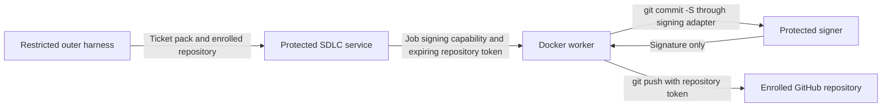

# Direct worker signing and pushing

The worker must run `git commit -S` and `git push` itself. VM provisioning is
outside this spike. Earlier publisher experiments rebuilt signed commits in a
helper; that remains evidence about sanitising Git inputs, but does not meet
this execution contract.

[The staged trial runbook](host-service-test-runbook.md) records the recommended
candidate, test gates and the live host/Docker permissions that blocked this
session. It does not claim the service or installer already exists.

The proposed split keeps reusable authority in a protected machine service and
delegates bounded operations to each Docker job:

The signing adapter implements Git's SSH signing interface. The protected signer
checks the job and authorised commit bytes, then returns an SSH signature. Git
in the worker constructs the final signed commit. Its ID stays unchanged when
pushed or used as the next ticket's parent. The worker receives a public key and
job capability, not the reusable private key. Exact candidate authorisation is
an experimental admission rule; a production coordinator must define how
incremental commits become authorised. It must not require publication before
the next local commit can be created.
[Git signing configuration](https://git-scm.com/docs/git-config).

The completed tests cover 18 signing cases, 18 push cases and one combined
two-ticket flow. In the combined flow the worker creates three signed commits,
pushes the same IDs to two branches, and starts the second ticket from the first
ticket's signed head. A second repository rejects the delegated token. These
tests use local Git and synthetic provider credentials. They create no live PRs.

For transport, a protected issuer can mint a GitHub App installation token with
an explicit single repository ID and minimum permissions. The worker can use
that token for HTTPS Git and the draft PR API. Renewal must retain the enrolled
repository and stop when the job ends. The worker receives real write authority
within that repository for the token's lifetime. Repository scope alone does
not restrict branches, require review or prevent destructive changes within the
repository. Those need provider rules or an enforced transport policy.
[Installation tokens](https://docs.github.com/en/apps/creating-github-apps/authenticating-with-a-github-app/generating-an-installation-access-token-for-a-github-app).

GitHub tokens expire after about one hour. Ending a job stops renewal; existing
tokens need explicit revocation or remain usable until expiry. A controller
crash or failed revocation leaves that interval. The synthetic provider's
job-aware gate and shorter test expiry are additional controls, not GitHub
guarantees. Issuing another token does not automatically revoke an older one.

A fine-grained PAT can select one repository, but cannot mint short-lived child
PATs. Supplying it to the worker exposes that longer-lived token to worker code.
A writable SSH deploy key also limits Git access to one repository, but does not
provide the REST API access needed to create PRs. Neither option removes the
need to protect reusable credentials on the host.
[PAT limits](https://docs.github.com/en/authentication/keeping-your-account-and-data-secure/managing-your-personal-access-tokens),
[deploy keys](https://docs.github.com/en/authentication/connecting-to-github-with-ssh/managing-deploy-keys).

The installation direction is one protected machine service and a small
repository enrolment containing an SDLC version, repository identity and check
configuration. A user-editable CLI may submit requests, but cannot alter the
service's installed code, credentials or policies. Credentials do not belong
in the enrolled repository. Updating SDLC changes future jobs after validation;
running jobs retain their version. This is a discovery direction, not an
implemented installer.

The host keys require an enforced ownership boundary. A system service runs
under a dedicated OS identity, with private data readable only by that identity
and installed code/configuration writable only through the protected installer.
The ordinary agent identity cannot read the key files, replace service code or
policy, administer the service, or inspect/execute inside jobs through Docker.
The service exposes only job-scoped operations and checks a grant on every
request. Caller UID alone cannot distinguish two agents sharing that UID;
grant storage and transport must also be protected. Administrator authority
remains with the human operator. That requires one machine installation, not
copying keys into every enrolled repository.
[Apple system-service installation](https://developer.apple.com/documentation/servicemanagement/updating-helper-executables-from-earlier-versions-of-macos).

The first proof uses fake authority and local Git. It cannot prove GitHub's
Verified display, organisation approval, Docker containment, or protection from
another host process sharing the service identity. A host agent with Docker
management access can execute inside the worker and steal its delegated token.
Leaving Full access disabled is not evidence that every file, socket and
authenticated client is blocked. The native service and the outer harness need
an executable access-denial test before real enrolment.

The actual same-UID controls could read disposable signer and issuer keys. A
native policy probe was unavailable because this environment refused to apply
the nested sandbox. The next decisive test is a legitimate unattended job
through the protected host service while a second host agent fails to read or
use its keys, modify its code/policy, steal another job's grant, or enter its
Docker worker. The current Docker socket is inaccessible to this shell, so a
live Docker/service test remains outstanding.

An SSH Git signature does not contain a repository identity. An approved signed
commit may be copied to another repository; the push credential controls where
this worker has write authority. Job expiry prevents new signing requests but
does not erase an existing public signature.
